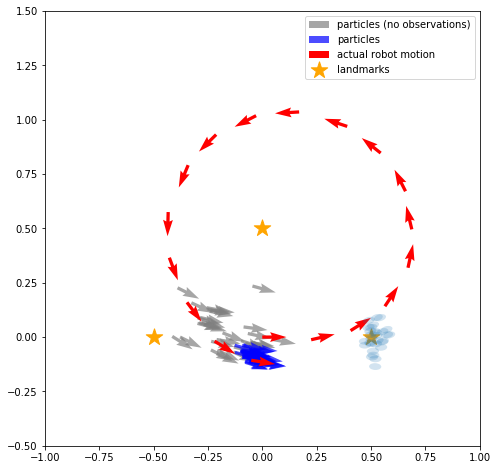
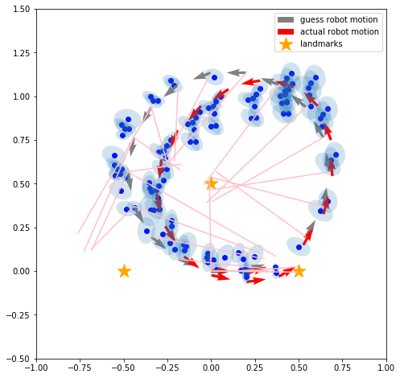
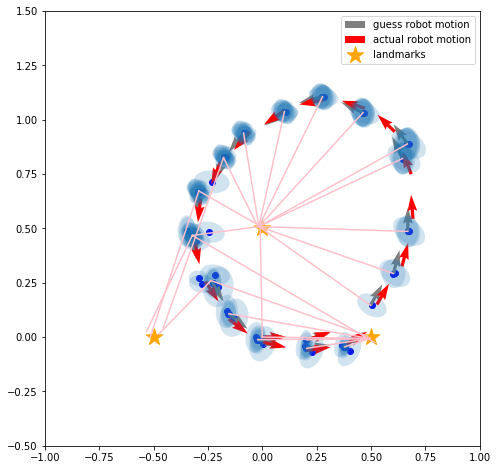

---
Keywords:プログラミング,確率ロボティクス
Copyright: (C) 2017 Ryuichi Ueda
---

# Jupyter notebookで確率ロボティクスのコードを書いていくプロジェクトを始めた

 
 
表題の通りの新プロジェクトを始めました。この前までは<a href="https://ryuichiueda.github.io/GlueLangDoc_ja/" target="_blank">プログラミング言語兼シェルのGlueLang</a>を作ってましたが、これは一段落がついてOSCかどこかで発表をするというフェーズに入っています。ユーザがほとんどいませんが、地道に増やして行きたいです。歳をとると（そうでなくても）、やむを得ない理由もないのに手が止まって評論家みたいになっちゃう人たちがいるのは、Facebookで地球マーク持論撒き散らし系を見てるとよく分かるかとは思いますが、自分は死ぬまでそうはならんぞと、一人、誰に頼まれているわけでもなく意気込んでいます。（なんで毒づいているんだろう？） 
 
&nbsp; 
 
あ、安心してください。ちゃんと研究も履いてますよ！じゃなかったやってますよ！ 
<h2>新プロジェクトでやること</h2> 
今回やることは、10年前に翻訳したこの本: 
 
[amazonjs asin="4839952981" locale="JP" title="確率ロボティクス (プレミアムブックス版)"] 
 
のアルゴリズムと、本に掲載されていない新しいアルゴリズムをjupyter notebookで記述することです。ご存知の方も多いはずですが、確率ロボティクス関係のコードの例は<a href="https://twitter.com/Atsushi_twi" target="_blank">\@Atsushi_twi</a>さんが<a href="http://myenigma.hatenablog.com/entry/20140628/1403956852">Matlabで書いて</a>いらっしゃるので、見比べて参考にしていただければと。図が似ちゃってすみません。 
<h2>目的</h2> 
<ul> 
 	<li>講義で使う（予定があるだけでも大学院の後期の講義、とある中部地方の大学での非常勤講師、五月の<a href="http://www.rsj.or.jp/seminar/s105/" target="_blank">ロボット学会のセミナー</a>と色々）</li> 
 	<li>自分で書いたコードでないと説明が大雑把になるので自分で一通りコードを書く</li> 
 	<li>翻訳本に引き続き日本語のドキュメントを充実してパブリックに晒す</li> 
</ul> 
もちろん、最先端ではないのですが、特に日本語話者で基本的なアルゴリズムを知っている人が増えて層が厚くなれば、最先端を目指す人も増えるだろうと考えています。もちろん、自分も早く最先端に追いつきたいのですが、もうちょっと時間がかかりそうですし、教育も重要なのでバランスよく貢献したいと思ってます。 
<h2>さっそく2つ作った</h2> 
とりあえず<a href="https://github.com/ryuichiueda/probrobo_practice/blob/master/monte_carlo_localization/observation_compare_no_observation.ipynb" target="_blank">Monte Carlo Localization</a>と<a href="https://github.com/ryuichiueda/probrobo_practice/blob/master/graph-based_SLAM/graph-based_slam.ipynb" target="_blank">graph-based SLAM</a>を実装しました。リンク先にはコードだけでなく、図も出力されています。jupyter notebookとGitHubの機能はただただ素晴らしいですね。（PCから閲覧しないと、コードや図が見えずにJSONのデータが見えてしまうかもしれません。） 
 
解説はコードの中に書いていく予定（少し書いてありますが、なんとなく英語で書き始めてしまったので日本語にしていきます）ですので、ここでは画像だけ貼ってお茶を濁すことにします。まだ始めて4日目なので、細かい話はご勘弁を。 
<h3>Monte Carlo Localization</h3> 
この図は、ロボットがランドマーク（星）の距離と見える向きを測って自己位置推定している様子です。ロボット（赤い矢印）が座標(0,0)の原点からスタートして、ぐるっと円を描いて、今は原点の下あたりにいます。 
 
&nbsp; 
 
 
 
現在の赤い矢印の下に、青い矢印の集団がいますが、この矢印一つ一つはランドマーク観測とデッドレコニング情報から推定されたロボットの候補点（パーティクル）です。灰色の矢印は、デッドレコニングのみで推定したときのパーティクルを比較で表示したもので、青い矢印より拡散して推定がボケているのが分かります。 
 
右下のランドマークに水色の楕円がたくさんあるのは、ロボットのランドマーク計測結果を各パーティクルの位置からプロジェクションしたもので、この楕円がランドマークの位置に近いパーティクルが、次のステップのパーティクルを生成するときに重視されます。 
<h3>graph-based SLAM</h3> 
確率ロボティクスになかった（GraphSLAMという似たものはある）ので、新たに説明文を作るには自分で実装するしかなく、このプロジェクトを始めたきっかけになったアルゴリズムです。GraphSLAMとはちょっと違うという認識ですが、どこが違うか（確かデッドレコニングのデータの扱いだったような）はもう一度読まないと思い出せません。解説の文章は<a href="http://ieeexplore.ieee.org/document/5681215/" target="_blank">こちら</a>にありますが、同様の内容のものが書いたご本人によってアップされているので探してみていただければと。 
 
graph-based SLAMはオフラインの地図生成手法で、ロボットのデッドレコニング情報とランドマーク計測の情報を集めてから、後処理でロボットがたどったパスを求め、そこからランドマークの位置を求めます。図は、上が集めた情報、下が集めた情報からSLAMでパスを求めた結果です。赤の矢印がロボットの真のパス、灰色が推定値で、上の図ではデッドレコニングで求めたパスそのままですが、下では修正されて赤の矢印に近くなっています。なお、ランドマーク計測では、ロボットからの距離と見える向きの他に、ランドマークにも向きがあって、ロボットからそれが観測できるという前提を置いています。ランドマークは互いに識別可能という前提も置いています。 
 
 
 
 
 
&nbsp; 
 
水色の楕円は二箇所から同じランドマークを観測したときに、一つの位置からもう一方の位置がどこに推定されて、その信頼性（共分散行列）がどのように広がっているかを示しています。要はこれらの楕円を推定されるパス上に寄せていくことで推定を進めていくのがこのアルゴリズムです。ピンク色の線は推定位置から見えたランドマークの位置を指しており、これも推定が進むと正解の位置に揃ってきます。 
 
&nbsp; 
 
なお、センサの精度を上げてやるともっとドンピシャで合ってかっこ良いのですが、さすがに都合が良すぎるのでちょっと下げてやってます。 
 
&nbsp; 
 
とりあえず5月の講演に向けてちまちま作っていく所存。
