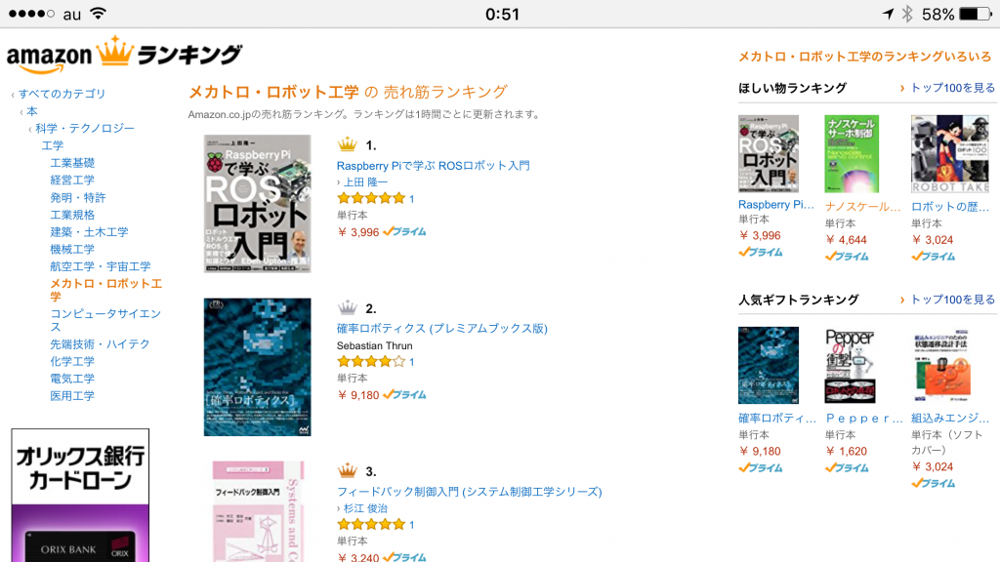
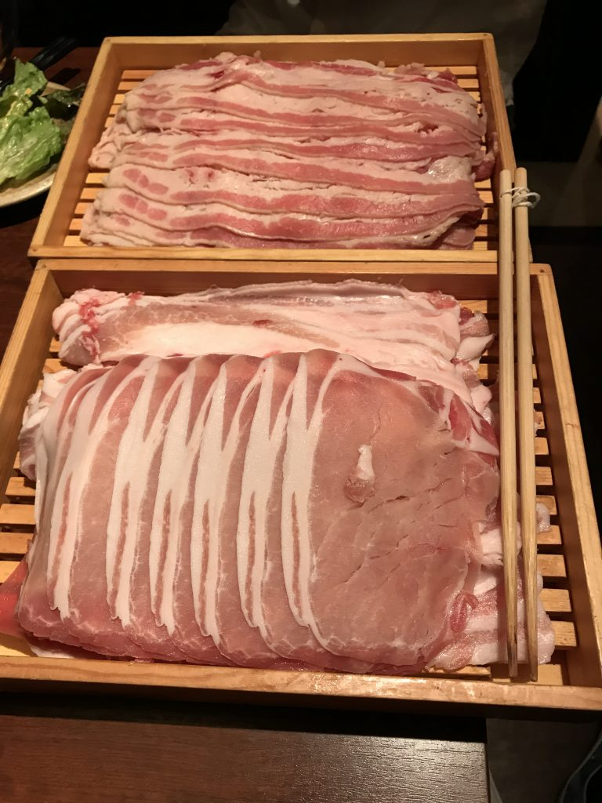

# 週末の出来事と作業等

今週末のできごとです。

<h2>自己位置推定のサンプルプログラム</h2>
&nbsp;

<a href="https://github.com/ryuichiueda/probrobo_practice">このリポジトリ</a>に<a href="https://github.com/ryuichiueda/probrobo_practice/blob/master/monte_carlo_localization/5.global_localization.ipynb">大域的自己位置推定</a>、<a href="https://github.com/ryuichiueda/probrobo_practice/blob/master/monte_carlo_localization/6.kidnapped_robot_problem.ipynb">誘拐ロボット問題</a>、<a href="https://github.com/ryuichiueda/probrobo_practice/blob/master/monte_carlo_localization/7.expansion_resetting.ipynb">膨張リセット</a>の例を追加。水曜の中部大の非常勤講師で説明する予定です。

&nbsp;
<h2>ビデオの整理</h2>
学部生のときから撮りためてある<a href="/?page=09712">研究関係のビデオ</a>、<a href="/?page=09678">シェル芸勉強会のビデオ</a>、<a href="/?page=09663">ラズパイマウス関係のビデオ</a>を整理して一部をYoutubeにアップ。また、以前から置いてあった<a href="/?page=00851">Team ARAIBOの動画</a>も、メニューの「映像集」から行けるようにしました。

研究関係のビデオについては古いのは2001年のものがありました。初代AIBOでサッカーやってるお宝動画が出てきましたが、自分がまだペーペーだったこともあって今回は掲載を自重しました。
<h2>Amazonの本の売上ランキング</h2>
今週は面白い動きだったのでつい何回も確認していました。ラズパイマウス本も確率ロボティクスもROBOMECH効果なのかよく売れて、Amazonのメカトロ・ロボット工学部門で瞬間的にワンツーになりました（健康食品の宣伝で使われるような細分化されたランキングなので1位自体は珍しくありません）。発売が10年違うものが並んで驚きです。

&nbsp;
<h2>Software Design 1月号の打ち上げ</h2>
シェル30本ノック企画に参加された皆さんと少し遅い打ち上げを金曜に行いました。編集の吉岡さんに手配いただきました。大阪、福岡でサテライトを主宰されているくんすとさんとぱぴろんさんもわざわざ武蔵小杉まで駆けつけてくださいまして、話すことが尽きない会とあいなりました。

一次会ではしゃぶしゃぶをみんなで食べたのですが、食べ放題でいくつかメニューから選べるのに、最初に持ってこられたノルマのイニシャル肉が多すぎて、イニシャル肉オンリーフィニッシュがキマッてしまいました。店の策略か、ふだん省エネで生きるシェル芸人の習性ゆえなのか。

&nbsp;

[caption id="attachment_9763" align="aligncenter" width="660"] お通し（違う）[/caption]

もしかしたら、このメンバーでまた何かあるかもやしれません。ないかもしれません。
<h2>その他</h2>
&nbsp;

いちおう家事もやってます。

<blockquote class="twitter-tweet" data-lang="ja">
餃子に二郎の切り方でニンニクを入れたら完全にラーメン二郎風味の餃子になた。
&mdash; Ryuichi Ueda (\@ryuichiueda) <a href="https://twitter.com/ryuichiueda/status/863709584560607232">2017年5月14日</a></blockquote> 

寝る。
