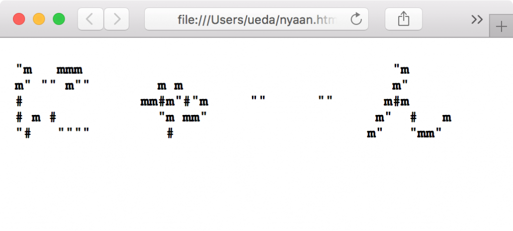

# 【問題と解答】第29回激しいシェル芸勉強会
<a href="https://blog.ueda.tech/?p=9906">問題のみのページはこちら</a>

<h2>問題で使うファイル等</h2>
GitHubにあります。ファイルは

<a href="https://github.com/ryuichiueda/ShellGeiData/tree/master/vol.29" target="_blank">https://github.com/ryuichiueda/ShellGeiData/tree/master/vol.29</a>

にあります。

クローンは以下のようにお願いします。

[bash]
$ git clone https://github.com/ryuichiueda/ShellGeiData.git
[/bash]

<h2>環境</h2>
解答例はUbuntu Linux 16.04 で作成。Macの場合はcoreutilsをインストールの上、gsedをつかいましょう。BSD系の人は玄人なので各自対応のこと。

<h2>イントロ</h2>
<ul>

	<li><a href="https://blog.ueda.tech/?presenpress=%E7%AC%AC29%E5%9B%9E%E6%BF%80%E3%81%97%E3%81%84%E3%82%B7%E3%82%A7%E3%83%AB%E8%8A%B8%E5%8B%89%E5%BC%B7%E4%BC%9A#/">こちら</a></li></ul>

<h2>Q1</h2>

次の2つのファイルは、講義で出した課題1,2それぞれの点数です。

[bash]
$ cat kadai1
001 山田 20
002 出川 30
005 鳥海 44
$ cat kadai2 
001 山田 20
003 上田 15
004 今泉 22
005 鳥海 44
[/bash]

両方に名前のある人については点数を合計して、次のように全員の得点リストを作ってください。

[bash]
001 山田 40
002 出川 30
003 上田 15
004 今泉 22
005 鳥海 88
[/bash]

<h3>解答</h3>

[bash]
$ join -a 1 -a 2 -1 1 -2 1 kadai{1,2} | awk '{print $1,$2,$3+$5}'
001 山田 40
002 出川 30
003 上田 15
004 今泉 22
005 鳥海 88
[/bash]

<h2>Q2</h2>

次の2つのファイルは、5回の講義の出欠と6回目の講義で出席した人の番号のデータです。attendに6回目の講義の出欠を反映したデータを標準出力に出力してください。

[bash]
$ cat attend
001 山田 出出欠出出
002 出川 出出欠欠欠
003 上田 出出出出出
004 今泉 出出出出出
005 鳥海 欠出欠出欠
$ cat attend6
001,005,003
[/bash]

<h3>解答</h3>

[bash]
$ tr , '\\n' &lt; attend6 | sort | sed 's/$/ 出/' |
 join -a 1 attend - |
 awk 'NF==3{print $0&quot;欠&quot;}NF==4{print $1,$2,$3$4}'
[/bash]

<h2>Q3</h2>

次の2つのファイルは5回の講義の出欠とテストの成績を記録したファイルです。

[bash]
###$1: 番号, $2: 名前, $3: 出欠 ###
$ cat attend 
001 山田 出出欠出出 
002 出川 出出欠欠欠
003 上田 出出出出出
004 今泉 出出出出出
005 鳥海 欠出欠出欠
###$1: 番号, $2: テストの点数（受けてない人のデータは無い）###
$ cat test 
001 90
002 78
004 80
005 93
[/bash]

こういうルールで、最終的な点数を出して、番号、名前、点数を記録したファイル作ってください。

<ul>
	<li>出席が過半数に満たない人、テストを受けていない人は0点</li>
	<li>出席が過半数の人はテストの点数を採用</li>
</ul>

<h3>解答</h3>

[bash]
$ join -a 1 -o 1.1 1.2 1.3 2.2 -e 0 attend test |
 awk '/(.*欠){3}/{$4=0}{print}'
001 山田 出出欠出出 90
002 出川 出出欠欠欠 0
003 上田 出出出出出 0
004 今泉 出出出出出 80
005 鳥海 欠出欠出欠 0
[/bash]

<h2>Q4</h2>

<h3>Q4.1</h3>

次の出力をパイプで受けて

[bash]
$ echo -1 4 5 2 42 421 44 311 -9 -11
[/bash]

次のように同じ桁のものを横並びに出力を得てください。横に並べる時の順番は任意とします。また、この出力のように正の数と負の数を分けます。

[bash]
-11 
-9 -1 
2 4 5 
42 44 
311 421 
[/bash]

<h3>Q4.2</h3>

次の出力をパイプで受けて

[bash]
$ echo -1 +4 5 2 42 421 44 311 -9 -11
[/bash]

次のように同じ桁のものを横並びに出力を得てください。Q1.1と同じく横に並べる時の順番は任意とします。

[bash]
-11 
-9 -1 
2 +4 5 
42 44 
311 421 
[/bash]

<h3>解答</h3>

<h4>Q4.1</h4>

[bash]
$ echo -1 4 5 2 42 421 44 311 -9 -11 | xargs -n 1 | sort -n |
 awk 'length(a) != length($1){print &quot;&quot;}{printf(&quot;%d &quot;,$1);a=$1}' |
 awk 'NF'
-11 
-9 -1 
2 4 5 
42 44 
311 421 
[/bash]

<h4>Q4.2</h4>

awk内で1をかけると+符号が外れるので、符号を外して桁数を比較すると先ほどの解答例が転用できます。

[bash]
$ echo -1 +4 5 2 42 421 44 311 -9 -11 | xargs -n 1 | sort -n |
 awk 'length(a*1) != length($1*1){print &quot;&quot;}{printf(&quot;%s &quot;,$1);a=$1}' |
 awk 'NF'
-11 
-9 -1 
+4 2 5 
42 44 
311 421 
[/bash]

<h2>Q5</h2>

次のファイルの中身について、

[bash]
$ cat triangle 
 1
 3 9
 7 a 6
8 4 2 5
[/bash]

次のように右に転がしてください。できる人はawkを使わないでやってみましょう。

[bash]
 8 
 4 7 
 2 a 3 
5 6 9 1
[/bash]

<h3>解答</h3>

四角にして回すと楽です。

[bash]
$ cat triangle | sed 's/ /0 /g' | sed 's/\\([^ ]\\)0/\\1/g' |
 tac | rs -T | tr -d 0 | sed 's/ / /g' | sed '1s/^/ /' |
 sed '2s/^/ /' | sed '3s/^/ /'
 8 
 4 7 
 2 a 3 
5 6 9 1
[/bash]

<h2>Q6</h2>

次の1から100までの素数を書いたファイル（いくつか欠番が存在）について、

[bash]
$ cat prime 
2 3 5 7 11 13 17 19 31 37 41 43 47 53 59 67 71 73 79 83 89 97
[/bash]

次のように欠番のところで折り返してください。（ワンライナーの中に欠番を直接書かないでくださいね。）

[bash]
2 3 5 7 11 13 17 19 
31 37 41 43 47 53 59 
67 71 73 79 83 89 97
[/bash]

<h3>解答</h3>

[bash]
$ cat prime | xargs -n 1 | cat - &lt;(seq 1 100 | factor |
 awk 'NF==2{print $2}') | sort -n | xargs |
 awk '{for(i=1;i&lt;NF;i+=2){if($i==$(i+1)){printf(&quot;%d &quot;,$i)}else{print &quot;&quot;;i-=1}}}' |
 awk 'NF'
2 3 5 7 11 13 17 19 
31 37 41 43 47 53 59 
67 71 73 79 83 89 97 
[/bash]

<h2>Q7</h2>

リポジトリ内のnyaan.htmlは、ブラウザで見ると次のように見えます。

次のようにcatから始めて、この文字を（大きなまま）端末上に表示してみてください。
[bash]
$ cat ./nyaan.html | ...
[/bash]

できる人は小さい通常の文字で「にゃーん」と出してみてください（これは解答例を考えていません）。

<h3>解答</h3>

[bash]
$ cat ./nyaan.html | nkf --numchar-input |
 sed 's/&lt;[^&lt;]*&gt;//g' | sed 's/&amp;quot;/&quot;/g'
[/bash]

<h2>Q8</h2>

次のshellgeiファイルについて、

[bash]
$ cat shellgei 
 m 
 &quot;&quot;m m &quot;m # # # # 
 mm # # #mmm&quot;&quot;&quot; m&quot; 
 &quot; m&quot; mmm&quot;&quot; # # # m&quot; # mm&quot;&quot;m 
 m&quot; #mm m&quot; # m&quot; &quot; # # 
 &quot;mm&quot;&quot; &quot;&quot;&quot;&quot; &quot; m&quot; #&quot; m&quot; # 
 
 
[/bash]

次のように、文字の無い列を詰めてください。

[bash]
 m 
 &quot;&quot;m m &quot;m # # # #
mm # # #mmm&quot;&quot;&quot; m&quot; 
 &quot; m&quot; mmm&quot;&quot; # # # m&quot; # mm&quot;&quot;m 
 m&quot; #mm m&quot; # m&quot; &quot; # # 
&quot;mm&quot;&quot; &quot;&quot;&quot;&quot; &quot;m&quot; #&quot; m&quot; # 
[/bash]

<h3>解答</h3>

[bash]
$ cat shellgei | sed 's/ /\@/g' | sed 's/./&amp; /g' |
 awk '{for(i=1;i&lt;=NF;i++){if($i!=&quot;\@&quot;)a[i]=$i}}END{for(i=1;i&lt;=NF;i++){b=a[i]==&quot;&quot;?&quot;x&quot;:&quot; &quot;;printf b}}END{print &quot;&quot;}' |
 cat - shellgei |
 awk 'NR==1{a=$0}{for(i=1;i&lt;=length($0);i++){if(substr(a,i,1)!=&quot;x&quot;)printf substr($0,i,1)};print &quot;&quot;}'
 
 m 
 &quot;&quot;m m &quot;m # # # #
mm # # #mmm&quot;&quot;&quot; m&quot; 
 &quot; m&quot; mmm&quot;&quot; # # # m&quot; # mm&quot;&quot;m 
 m&quot; #mm m&quot; # m&quot; &quot; # # 
&quot;mm&quot;&quot; &quot;&quot;&quot;&quot; &quot;m&quot; #&quot; m&quot; # 
 
 
[/bash]

もっと良い解答。

<blockquote class="twitter-tweet" data-lang="ja">
<a href="https://twitter.com/hashtag/%E3%82%B7%E3%82%A7%E3%83%AB%E8%8A%B8?src=hash">#シェル芸</a> <a href="https://twitter.com/hashtag/%E7%A6%8F%E5%B2%A1?src=hash">#福岡</a> Q8解答 $ cat shellgei | tr &#39; &#39; &#39;-&#39; | sed &#39;s/./&amp; /g;s/ $//&#39; | rs -T | grep -v &#39;^[- ]*$&#39; | rs -T | tr -d &#39; &#39; | tr - &#39; &#39;
&mdash; ぱぴろんちゃん👓 (\@papiron) <a href="https://twitter.com/papiron/status/881038102998810626">2017年7月1日</a></blockquote>

