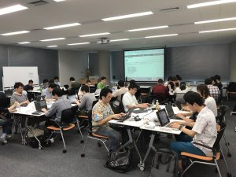

# 第29回シェル芸勉強会まとめ
今回も共催の<a href="https://www.jus.or.jp/">日本UNIXユーザ会</a>様、会場提供の<a href="https://www.sakura.ad.jp/">さくらインターネット</a>様、参加者の皆様のご協力のもと、シェル芸勉強会を開催しました。

<a href="https://blog.ueda.tech/?p=9870">今回の問題</a>は、ここ数回では難易度が下がったようで、会場では安堵の声、体力を奪われなかったという声が聞かれました（どんな会なんだ・・・）。

以下、単にリンクの貼り付け集ですが、当日の様子が分かるまとめです。

<h2>Twitterまとめ</h2>

<blockquote class="twitter-tweet" data-partner="tweetdeck">
ほぼほぼ編集完了しまいた。昨日は激しかったですね。<a href="https://twitter.com/hashtag/%E3%81%97%E3%82%8D%E3%82%81?src=hash">#しろめ</a> <a href="https://twitter.com/hashtag/%E3%82%B7%E3%82%A7%E3%83%AB%E8%8A%B8?src=hash">#シェル芸</a> | jus共催 第29回シェル芸勉強会 \@さくらインターネットさん - Togetterまとめ <a href="https://t.co/XRG88i7YmM">https://t.co/XRG88i7YmM</a> <a href="https://twitter.com/togetter_jp">\@togetter_jp</a>さんから
&mdash; Ryuichi Ueda (\@ryuichiueda) <a href="https://twitter.com/ryuichiueda/status/881333495192199169">July 2, 2017</a></blockquote>

<h2>録画</h2>

<iframe width="560" height="315" src="https://www.youtube.com/embed/-0DltBwo_5k" frameborder="0" allowfullscreen></iframe>

<iframe width="560" height="315" src="https://www.youtube.com/embed/GyyKvbrcRyw" frameborder="0" allowfullscreen></iframe>

<iframe width="560" height="315" src="https://www.youtube.com/embed/781cEwIQX-w" frameborder="0" allowfullscreen></iframe>

あと、大阪のLTの録画がありますが、それは大阪のレポートから辿っていただければと。

<h2>サテライト会場の様子</h2>

大阪、福岡で開いていただきました。ありがとうございました。

<h3>福岡</h3>

<blockquote class="twitter-tweet" data-partner="tweetdeck">
<a href="https://twitter.com/hashtag/%E3%82%B7%E3%82%A7%E3%83%AB%E8%8A%B8?src=hash">#シェル芸</a> <a href="https://twitter.com/hashtag/%E7%A6%8F%E5%B2%A1?src=hash">#福岡</a> 忘れないうちに書いちゃいました・・・ 第29回シェル芸勉強会へ遠隔参加 - 日々之迷歩 <a href="https://t.co/4AbF6NQuzH">https://t.co/4AbF6NQuzH</a>
&mdash; ぱぴろんちゃん👓 (\@papiron) <a href="https://twitter.com/papiron/status/881198132217880576">July 1, 2017</a></blockquote>

<h3>大阪</h3>

<blockquote class="twitter-tweet" data-lang="ja">
はてなブログに投稿しました <a href="https://twitter.com/hashtag/%E3%81%AF%E3%81%A6%E3%81%AA%E3%83%96%E3%83%AD%E3%82%B0?src=hash">#はてなブログ</a> <a href="https://twitter.com/hashtag/%E3%82%B7%E3%82%A7%E3%83%AB%E8%8A%B8?src=hash">#シェル芸</a> 「第29回シェル芸勉強会　大阪サテライト」レポート - くんすとの備忘録<a href="https://t.co/i5tJv9sw77">https://t.co/i5tJv9sw77</a>
&mdash; くんすと (\@kunst1080) <a href="https://twitter.com/kunst1080/status/881535147673243649">2017年7月2日</a></blockquote> 

<blockquote class="twitter-tweet" data-partner="tweetdeck">
東京では絶滅したcurl <a href="https://twitter.com/hashtag/%E3%82%B7%E3%82%A7%E3%83%AB%E8%8A%B8?src=hash">#シェル芸</a> <a href="https://t.co/D2Pw8bz4kK">pic.twitter.com/D2Pw8bz4kK</a>
&mdash; ぐれさん (\@grethlen) <a href="https://twitter.com/grethlen/status/881053495935107072">July 1, 2017</a></blockquote>

<h2>LTなどのスライドやブログ</h2>

大阪のLTは（やばすぎるので、ということではないですが）大阪からのレポートにお任せします。

<blockquote class="twitter-tweet" data-lang="ja">
午前の部のスライドです。 参加された皆さん、ありがとうございました。<a href="https://t.co/KVqsFx2sxq">https://t.co/KVqsFx2sxq</a><a href="https://twitter.com/hashtag/%E3%82%B7%E3%82%A7%E3%83%AB%E8%8A%B8?src=hash">#シェル芸</a>
&mdash; Hidekazu Toriumi (\@hid_tori) <a href="https://twitter.com/hid_tori/status/881021071847079938">2017年7月1日</a></blockquote>

<blockquote class="twitter-tweet" data-lang="ja">
先程発表したシェル芸クワインです。 <a href="https://t.co/hwHjOCC1x6">https://t.co/hwHjOCC1x6</a> <a href="https://twitter.com/hashtag/%E3%82%B7%E3%82%A7%E3%83%AB%E8%8A%B8?src=hash">#シェル芸</a>
&mdash; yasuhiroki (\@duck_yasuhiroki) <a href="https://twitter.com/duck_yasuhiroki/status/881067438984404992">2017年7月1日</a></blockquote>

<blockquote class="twitter-tweet" data-lang="ja">
遅くなりましたが、先週のシェル芸勉強会のまとめ書きました〜。<a href="https://t.co/Nmd5xoY1AO">https://t.co/Nmd5xoY1AO</a><a href="https://twitter.com/hashtag/%E3%82%B7%E3%82%A7%E3%83%AB%E8%8A%B8?src=hash">#シェル芸</a> <a href="https://twitter.com/hashtag/javascript%E3%82%B7%E3%82%A7%E3%83%AB%E8%8A%B8?src=hash">#javascriptシェル芸</a>
&mdash; ぷる (\@butackle66) <a href="https://twitter.com/butackle66/status/883552465588596737">2017年7月8日</a></blockquote> 

<blockquote class="twitter-tweet" data-lang="ja">
第29回シェル芸勉強会に参加してきました(復習) 俺的備忘録 〜なんかいろいろ〜<a href="https://t.co/RKG3QNjTM2">https://t.co/RKG3QNjTM2</a>
&mdash; Blacknon(エビス) (\@blacknon_) <a href="https://twitter.com/blacknon_/status/881437400735469569">2017年7月2日</a></blockquote> 

<blockquote class="twitter-tweet" data-lang="ja">
第29回激しいシェル芸勉強会 on <a href="https://twitter.com/Qiita">\@Qiita</a> <a href="https://t.co/Wb22iAdZ7H">https://t.co/Wb22iAdZ7H</a>
&mdash; 多田氏 (\@asterisk9101) <a href="https://twitter.com/asterisk9101/status/881365532691243008">2017年7月2日</a></blockquote> 

<blockquote class="twitter-tweet" data-lang="ja">
シェル芸に感じで平凡な記事を書いている途中ですはい。<a href="https://t.co/Xgum4WWezs">https://t.co/Xgum4WWezs</a>
&mdash; しまじゃき (\@obknnt) <a href="https://twitter.com/obknnt/status/881654863507070976">2017年7月2日</a></blockquote>

<blockquote class="twitter-tweet" data-partner="tweetdeck">
第29回ぼっちシェル芸勉強会(in 自宅)を開催しました... Terrulam: 第29回シェル芸勉強会参加報告 <a href="https://t.co/3xx7hzZpA2">https://t.co/3xx7hzZpA2</a> <a href="https://twitter.com/hashtag/%E3%82%B7%E3%82%A7%E3%83%AB%E8%8A%B8?src=hash">#シェル芸</a> <a href="https://twitter.com/hashtag/usptomo?src=hash">#usptomo</a>
&mdash; ginjiro (\@gin_135) <a href="https://twitter.com/gin_135/status/884980843822944262">July 12, 2017</a></blockquote>

ブログなどなど、書いたら教えてくださーい。
