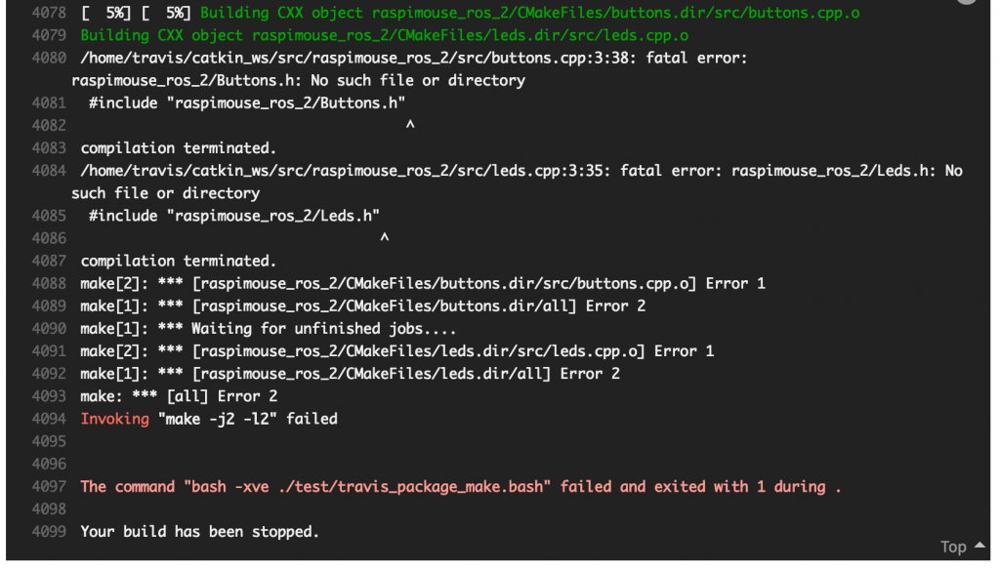

# CPUの個数でcatkin_makeが通ったり通らなかったり
表題の通り少しハマりました。ROSについては本を書いたものの、基礎的な内容+Pythonなので、C++のコードのビルドについてはほとんど勉強しておらず、良く分かってないのが良くわかりました。同じようにハマる人がこの記事を見つけてくれたらと。また、この症状の回避方法について良く知られているのならば教えていただければと。
<h2>症状</h2>
<ul>
 	<li>1. .msgファイルと、それを使うC++のコードを含むパッケージのcatkin_makeが、.msgファイルの処理の前にノードのコードのコンパイルを始めて一度コケるが、2度目で通る。</li>
</ul>
これはたぶん回避方法があるはずでちゃんと調べろという話ですが、面白いのは続きです。
<ul>
 	<li>2. Travis CIだと2回catkin_makeしても通らない。</li>
</ul>
これで「???」になりました。ちなみに1については、自分のデスクトップ機でもラズパイでも2回で通ります。

ちなみにエラーはこんな感じです。Buttons.hとLeds.hが、.msgファイルから作られるヘッダファイルで、これがないとC++のコードのところでヘッダファイルが無いと叱られます。

<a href="874755c34acd032ab196fd9db24b1783.png"></a>
<h2>原因</h2>
自分のPCやラズパイでは1回目のcatkin_makeはエラーを出すものの.msgの処理を完了できて、一方Travis CIの場合は完了できないということは、非同期処理のズレだろうというのがまず思いつきました。そして、Travis CIのエラーに

```bash
Invoking "make -j2 -l2" failed
```

とあったので、たぶんズレはコア数の違いで起こるんだろうと思いました。（makeのjオプションは、何並列で処理をするかを指定するオプションです。）

ということで、手元で

```bash
$ catkin_make -j2 
```

を繰り返したら、何回catkin_makeしても失敗するという、Travis CIで起きたのと同じ現象が起こりました。ちなみにPCのCPUのコア数は8、ラズパイでも4だったので、Travis CIの方が少ないということになります。
<h2>解決（超小手先）</h2>
ということで、Travis CIでcatkin_makeするシェルスクリプトの行を

```bash
catkin_make -j8 || catkin_make -j8 #CPU2個だけど8並列頑張ってね。しかも1回目コケたらもう一回やってね。
```

というように変更したらテストにパスしました。

お断りしておきますが、小手先です。何かすればコンパイルの順番を制御できるはずなのですが・・・。

<h2>完全解決</h2>

・・・と書いたら教えていただきました。

<blockquote class="twitter-tweet" data-partner="tweetdeck"><p lang="ja" dir="ltr">同じパッケージ内でC++のターゲットより先にmsgを先に処理したい場合、<br>add_dependencies(${TARGET_NAME} ${PROJECT_NAME}_generate_messages_cpp)<br>などと明示的に依存を指定するといいですよ</p>&mdash; akio (\@__akio__) <a href="https://twitter.com/__akio__/status/883338434919542786">July 7, 2017</a></blockquote>
<script async src="//platform.twitter.com/widgets.js" charset="utf-8"></script>

（もっと短い書き方がありそうですが）とりあえずベタにCMakeLists.txtに以下のように書いたら一回のcatkin_make（オプションなし）で通りました。

```bash
add_dependencies(leds ${TARGET_NAME} ${PROJECT_NAME}_generate_messages_cpp)
add_dependencies(buttons ${TARGET_NAME} ${PROJECT_NAME}_generate_messages_cpp)
add_dependencies(lightsensors ${TARGET_NAME} ${PROJECT_NAME}_generate_messages_cpp)
```

ありがとうございました！！！
