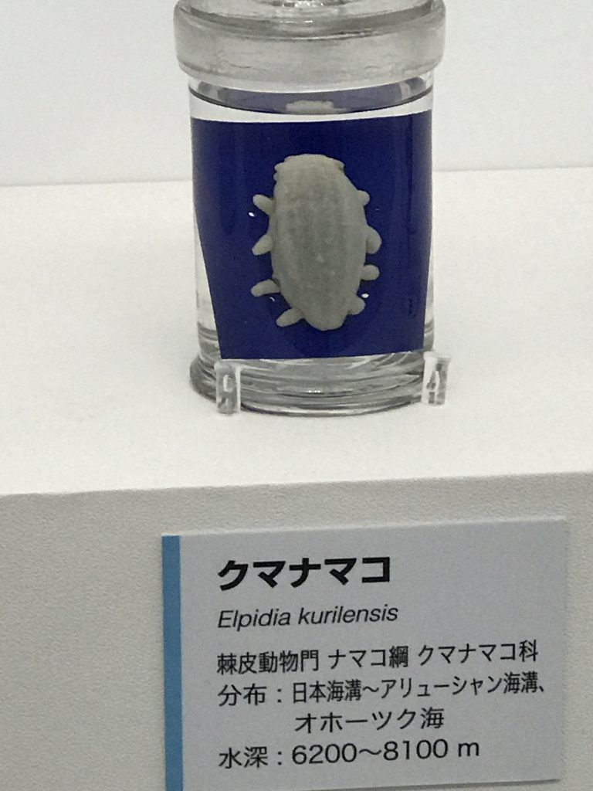
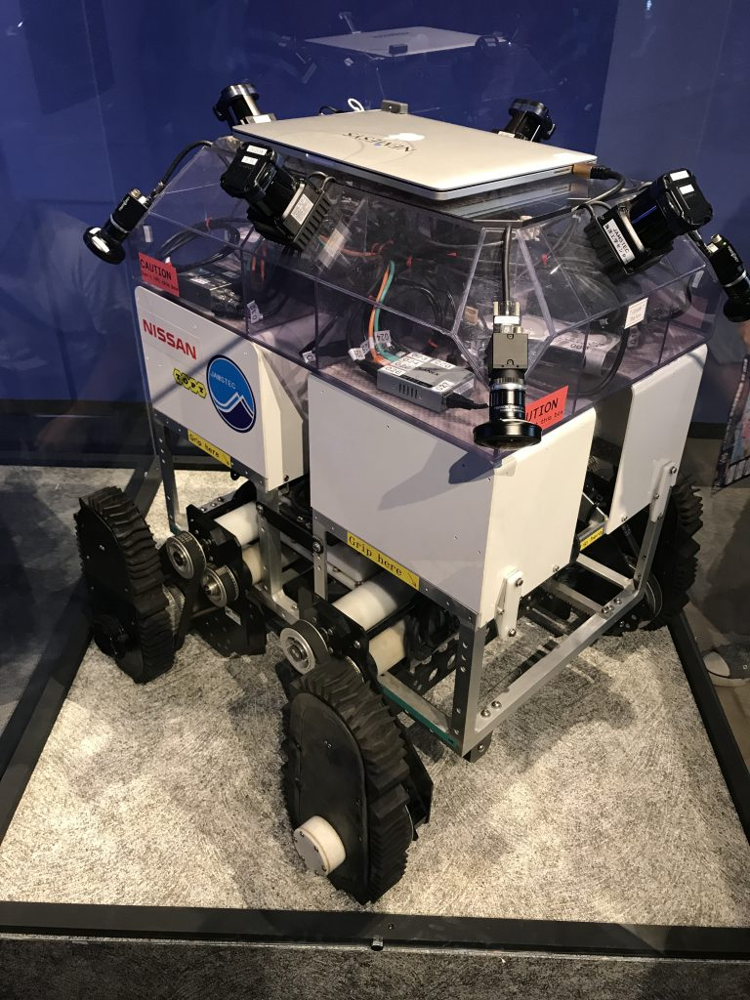

# 週末報
日曜夜に週末やったことのまとめをするのが習慣化してきました。

<h2>火曜に名古屋で話をするのでスライド</h2>

スライドを作っててなんとか完成させました。ファジー学会の第1回「動きの様相から先を読む」研究会（名古屋工業大学にて）という場でお話しさせていただきます。今回は珍しく「貴様の研究について話してよかろう」と言われましたので、自分の昔の研究とか今の研究とかを遠慮なく吐き出します。

<blockquote class="twitter-tweet" data-lang="ja">
火曜、ロボカップ勢と入れ替わりで話をしに行きます。<a href="https://t.co/dCAvt3VlCH">https://t.co/dCAvt3VlCH</a>
&mdash; Ryuichi Ueda (\@ryuichiueda) <a href="https://twitter.com/ryuichiueda/status/891655161570918401">2017年7月30日</a></blockquote> 

<h2>簡単な価値反復のサンプル</h2>

そろそろ後期の講義の準備に取り掛かろうということで作りました。後期に確率ロボティクスという講義を受け持ってるんですけど、ここ2年、数式を書き殴るだけだったのを反省して、Jupyter notebookベースで講義を進めようと準備しています。

<blockquote class="twitter-tweet" data-lang="ja">
後期の確率ロボティクスの講義に使う一番単純な価値反復のサンプル作った。<a href="https://t.co/eqM1ntqXhr">https://t.co/eqM1ntqXhr</a>
&mdash; Ryuichi Ueda (\@ryuichiueda) <a href="https://twitter.com/ryuichiueda/status/891658032362405888">2017年7月30日</a></blockquote> 

<h2>某原稿と某原稿の手直し</h2>

世に出るのは8月。

<h2>その他</h2>

子供が「深海2017～最深研究でせまる“生命”と“地球”～」という特別展に行きたいというので、上野の博物館行ってきました。

<blockquote class="twitter-tweet" data-lang="ja">
勝手に人間に名前を与えられて困惑のウルトラブンブクとハゲナマコ <a href="https://t.co/KqXbzzIrSl">pic.twitter.com/KqXbzzIrSl</a>
&mdash; Ryuichi Ueda (\@ryuichiueda) <a href="https://twitter.com/ryuichiueda/status/891283225003216896">2017年7月29日</a></blockquote> 

こんなのもいました。深いところにいるんですね。別の生物の説明に、これより深いとタンパク質の分子自体が水圧で壊れてしまうと書いてありました。

・・・と書いていて、なんで自分、ロボット屋なのに真っ先にこれ↓を貼らないんだろう、と思って頭に「？」が・・・。URGが四つとアラウンドビューモニター用のカメラが周囲に取り付けられておりました。NISSANとシールが貼ってあってアラウンドビューの画像が映されてました。

うちの子が天井にカメラがあると思って、顔を上に向けて自分の姿を写そうとしてましたが、横についてるカメラを合成して作ってるから上向いてもダメよーと説明しました。違ってたりして。

生物には無駄なものがほとんどないなーなどと、つい見とれてしまいます。そういう意味では、やっぱりロボットを見てるより生物（人間を含む）を見てる方が、自分には幸せなようです。

寝る。
