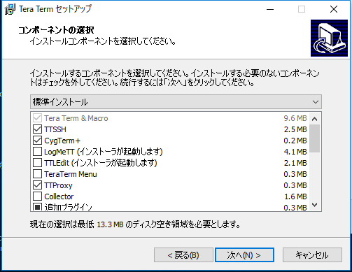
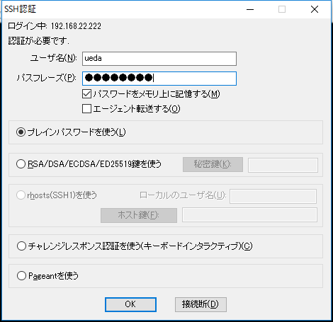

# Tera TermをWindowsにインストールしてからssh接続するまで
なぜ書くか: 自分のいろんな書籍や記事から参照するためです。いちいち本や記事に書くとページがかさむので・・・

<h2>ダウンロード</h2>
Tera Termで検索をかけてダウンロードページに行きます。今回は窓の杜を使います。

<a href="http://forest.watch.impress.co.jp/library/software/utf8teraterm/" target="_blank" rel="noopener">http://forest.watch.impress.co.jp/library/software/utf8teraterm/</a>

Tera Termにはいろいろ系統が存在して、Tera TermとTera Term ProやTera Term ポータブル版というものがありますが、通常はTera Termを選択してダウンロードします。

<h2>インストール</h2>

インストーラ（今回はteraterm-4.95.exe）をダウンロードしたら、ダブルクリックします。インストールを許可するかどうか聞いてくるので、許可するとインストールが始まります。

<h3>言語の選択</h3>

日本語を選択し、次に進みます。

<h3>使用許諾への同意</h3>

よく読んで同意でよければ同意して次に進みます。

<h3>コンポーネントの選択</h3>

デフォルトで。

<h3>言語の選択</h3>

また聞かれますが日本語で。

<h3>追加タスクの選択</h3>

お好みで、というところですが、デフォルトのままで大丈夫です。

<h3>インストール完了まで</h3>

あとは一本道です。

<h2>SSH接続</h2>

Tera Termを立ち上げると次のような画面が開きます。ホストにIPアドレス、サービスにSSHを選んで「OK」を押します。（以下、よく見るとスクリーンショットにあるIPアドレスがばらばらですが、気にしないでください。）

OKを押すと、初めて接続する相手の場合、次のような画面がでます。ここで慌てず「続行」を押します。

最後に、ユーザ名とパスワード（パスフレーズ）を聞いてきますので、正しく入力して「OK」を押します。

うまくいけば次のようにログインできます。

