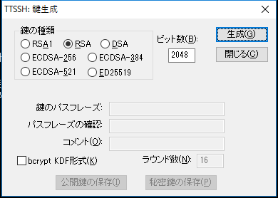

# Tera Termで鍵を作って鍵認証でサーバにログインするまで
なぜ書くか: 自分の本や雑誌から引用するためです。Tera Temrがインストールされている状態から始めます。

<h2>鍵を作る</h2>

鍵認証する相手のサーバにログインします。それができないなら適当なサーバにログインします。ログイン後、「設定」-> 「SSH鍵生成」をメニューから選んで、次のような画面を出します。

デフォルトのまま（RSA 2048）で「生成」を押します。

<h2>鍵の保存</h2>

次に、上記の画面の「公開鍵の保存」「秘密鍵の保存」を押します。保存はデスクトップにしておきましょう（いきなりTera TermのProgram Filesに置いても権限がなくて消える可能性があります）。

保存するときにパスフレーズが空だと言ってきますが、かまわず続行します。

保存したら、「閉じる」を押しましょう。

<h2>鍵をProgram Filesへ</h2>

次にエクスプローラーを開き、Tera Termの
Program Filesのフォルダ（私の環境だとC:\\Program Files (x86)\\teraterm）
に行きます。

そして、デスクトップからid_rsaとid_rsa.pubをドロップします。ここで、次のように管理者権限がないと言われますが、「続行」を選択します。

コピー後、フォルダの中にid_rsaとid_rsa.pubがあることを確認してください。

<h2>公開鍵をログイン先のサーバに移す</h2>

ログイン先のサーバにコピーします。もし、Tera Termでログイン先のサーバにすでにログインしている場合は、id_rsa.pubをTera Termの画面にドロップします。すると、次のような画面が表示されるので、そのまま「SCP」を押します。

すると、次のようにホームにid_rsa.pubが存在しているはずです。

[bash]
ueda\@becky:~$ ls id_rsa.pub
id_rsa.pub
[/bash]

<h3>.ssh/authorized_keysが存在している場合</h3>

次のようにすでに.ssh/authorized_keysが存在している場合は、

[bash]
ueda\@becky:~$ ls ~/.ssh/authorized_keys
/home/ueda/.ssh/authorized_keys
[/bash]

次の操作を行います。

[bash]
ueda\@becky:~$ cat id_rsa.pub &gt;&gt; .ssh/authorized_keys
[/bash]

<h3>.sshディレクトリが存在しているが、authorized_keysが存在していない場合</h3>

次のように.sshディレクトリがホームにあるのにauthorized_keysがない場合は、

[bash]
ueda\@becky:~$ ls -d ~/.ssh
/home/ueda/.ssh
[/bash]

次のようにします。

[bash]
ueda\@becky:~$ cat id_rsa.pub &gt;&gt; .ssh/authorized_keys
ueda\@becky:~$ chmod 644 .ssh/authorized_keys
[/bash]

<h3>.sshディレクトリすら存在していない場合</h3>

次のように打ちます。

[bash]
ueda\@becky:~$ mkdir .ssh
ueda\@becky:~$ chmod 700 .ssh
ueda\@becky:~$ cat id_rsa.pub &gt;&gt; .ssh/authorized_keys
ueda\@becky:~$ chmod 644 .ssh/authorized_keys
[/bash]

<h2>ログイン</h2>

サーバから一度ログアウトして、再度Tera Termを立ち上げます。ユーザ名とパスフレーズを入力するところで、ユーザ名を指定し、パスフレーズは空にして、下の「RSA/DSA...鍵を使う」を選択し、「秘密鍵」の横の欄にid_rsaと書きます。

これでOKを押すと、今までの設定が正しければログインできます。
