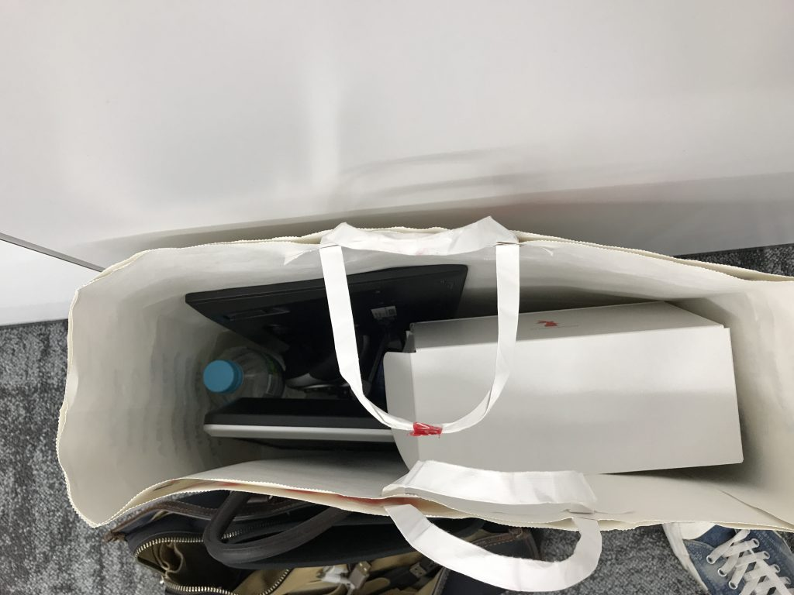

# ROS勉強会（ラズパイマウスハッカソン）に参加しました
本日のROS勉強会はラズパイマウスを使ったハッカソンということで、参加してきました。 
 
<iframe src="https://www.facebook.com/plugins/post.php?href=https%3A%2F%2Fwww.facebook.com%2FRaspberryPiMouse%2Fposts%2F1638512519506163&width=500" width="500" height="664" style="border:none;overflow:hidden" scrolling="no" frameborder="0" allowTransparency="true"></iframe> 
 
 
 
SLAMの動作確認のためにLinuxのGUI環境（普段はそんなもん使わない。CLIオンリー。）を仮想マシンで作らなければならなかったり、ネットワークがつながらないマシンの修理係などをやったりとちょくちょく中断しましたが、13時から18時まで、とにかくひたすらコードを書きました。書いている途中の写真がない・・・。 
 
 
[caption id="attachment_10118" align="aligncenter" width="660"] モニタがない状態でLANがつながらないと終わりなのでモニタ持参[/caption] 
 
成果は次の2点でした。 
 
<blockquote class="twitter-tweet" data-lang="ja">
本日の成果1: ラズパイマウスの基本ROSパッケージのモータノードに/odomのパブリッシュとtfの出力を加えました。 <a href="https://twitter.com/hashtag/rosjp?src=hash">#rosjp</a> <a href="https://twitter.com/hashtag/%E3%83%A9%E3%82%BA%E3%83%91%E3%82%A4%E3%83%9E%E3%82%A6%E3%82%B9?src=hash">#ラズパイマウス</a><a href="https://t.co/k691883wzF">https://t.co/k691883wzF</a>
&mdash; Ryuichi Ueda (\@ryuichiueda) <a href="https://twitter.com/ryuichiueda/status/898879017746432001">2017年8月19日</a></blockquote>  
 
<blockquote class="twitter-tweet" data-lang="ja">
本日の成果2: ラズパイマウスのgmappingパッケージを公開しました。書籍用のpimouse_rosと違ってこれからいろいろ手を入れていきます。<a href="https://t.co/7VFAkPaT90">https://t.co/7VFAkPaT90</a>
&mdash; Ryuichi Ueda (\@ryuichiueda) <a href="https://twitter.com/ryuichiueda/status/898879500728975361">2017年8月19日</a></blockquote>  
 
終わったあとは主催の皆様と人形町の肉寿司に行きました。こちらも食うのに夢中で写真がありません。 
 
<blockquote class="twitter-tweet" data-lang="ja">
握られますた。 <a href="https://t.co/6BYdRQMMiZ">pic.twitter.com/6BYdRQMMiZ</a>
&mdash; Ryuichi Ueda (\@ryuichiueda) <a href="https://twitter.com/ryuichiueda/status/898881252551303168">2017年8月19日</a></blockquote>  
 
 
以上、勉強会帰りの人のブログ的なテイストでお送りいたしました。参加側に回るのは本当に久しぶりです。主催者の皆様ありがとうございました！ 
 
 
 
アフィリエイトで恐縮ですが、持参したモニタはこれ↓です。 
[amazonjs asin="B01DBMVAO8" locale="JP" title="PUMPKIN 10インチ モニター ヘッドレスト1080P 高画質 HDMI対応 USB/SD/AV IN 18ヶ月保証 DVD再生できないタイプ"] 
 
 
寝る。
