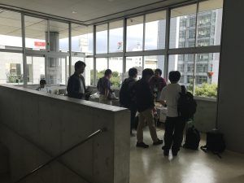
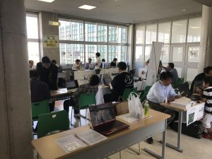

# 雑記（2017年9月2日）
<h3>シェル芸botの遷宮</h3> 
 
諸事情により、シェル芸botのお父様のVPSから、ConoHaから提供いただいているUSP友の会のVPSへ。友の会のVPSはCentOSだったがUbuntuに入れ替え。運用停止して様子見状態だったメーリングリストは廃止。ウェブサイトはrsync等を駆使して存続。bash製なので移植は極めて簡単だった。 
 
<blockquote class="twitter-tweet" data-lang="ja">
多分遷宮完了！
&mdash; ふるつき (\@theoldmoon0602) <a href="https://twitter.com/theoldmoon0602/status/903791744155779073">2017年9月2日</a></blockquote> 
 
 
<blockquote class="twitter-tweet" data-lang="ja">
💩 💩 💩 💩 💩 💩 💩 💩 💩 💩 <a href="https://t.co/EN3RCy7Us3">https://t.co/EN3RCy7Us3</a>
&mdash; シェル芸bot (\@minyoruminyon) <a href="https://twitter.com/minyoruminyon/status/903794375393767424">2017年9月2日</a></blockquote> 
 
 
良かったです。 
 
<h3><a href="https://www.ospn.jp/osc2017-chiba/">OSC</a></h3> 
 
苦手な事務を頑張って無事終了。102名というところで、もうちょいお呼びできたんでねえかと。どうも自分の押しの悪さが集客に微妙に効いているような気がしないでもない。シェル芸界隈にもっと呼びかければ良かったが・・・。 
 
[caption id="attachment_10264" align="aligncenter" width="300"] 秋のような清々しい天気でした。[/caption] 
 
 
 
<blockquote class="twitter-tweet" data-lang="ja">
謎設備TA <a href="https://twitter.com/hashtag/osc17cb?src=hash">#osc17cb</a> <a href="https://t.co/6Kch3EkVD6">pic.twitter.com/6Kch3EkVD6</a>
&mdash; Ryuichi Ueda (\@ryuichiueda) <a href="https://twitter.com/ryuichiueda/status/903888174568443904">2017年9月2日</a></blockquote> 
 
 
<blockquote class="twitter-tweet" data-lang="ja">
とってもヘルシー <a href="https://twitter.com/hashtag/osc17cb?src=hash">#osc17cb</a> <a href="https://t.co/ZED5J2sRBW">pic.twitter.com/ZED5J2sRBW</a>
&mdash; Ryuichi Ueda (\@ryuichiueda) <a href="https://twitter.com/ryuichiueda/status/903911411390193665">2017年9月2日</a></blockquote> 
 
 
自身の反省はさておき、会はとても良い雰囲気で進みました。お越しいただき有難うございました。 
 
<h3>本がよく売れる</h3> 
 
夏休み終わるから？ 
 
<h3>アサーション</h3> 
 
前回のシェル芸勉強会で鳥海さんがPerlのアサーションの話をされた時に、アサーション is 何？と調べていたら、<a href="https://www.direct-commu.com/colums/relation/relation_012_02_asa-shyon.html">こういうページ</a>が引っかかった。とても大事だと思う。Perl関係ないけど。特に自分の場合、発言が攻撃的な人が苦手なので（生理的にもビビってダメなのと、腐っても研究者として、議論の方法について厳しい訓練を受けているのでちょっとありえないと思うので）、急に「もう一生話しかけるな」ということをさらっと言って本当に話をしなくなることがあるので、その前にこういうのを勧めれば良いのではないかなと考えたり。余計なお世話か。 
 
<h3>raspimouse_ros_2の手直し</h3> 
 
本日<a href="https://github.com/ryuichiueda/raspimouse_ros_2">raspimouse_ros_2</a>（ラズパイマウスをROSで使うときの基本パッケージ）にプルリクエストをいただいて、<a href="https://blog.ueda.tech/?p=10115">この前のハッカソン</a>で作りっぱなしでテストが通っていないことを発見。tf2をTravisの環境にインストールしないといけなかったらしく、テストの環境構築スクリプトに1行追加。無事通った。 
 
 
早く寝たい。
