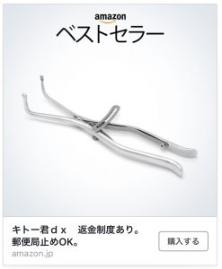

# 雑記（2017年9月3日）
<h3>ラズパイマガジン10月号</h3>

研究室4年の佐藤君（佐藤君は4人いるんだが。）と共著でラズパイマウスのライントレースについて執筆。
[amazonjs asin="4822259846" locale="JP" title="ラズパイマガジン 2017年10月号 (日経BPパソコンベストムック)"]

研究室のメンバーも別の記事で動作確認などで裏方をしたので研究室にたくさん見本誌が届きました・・・と言いたいところだけど自宅に届いたので月曜に輸送しなければならず地獄の様相。ともかく仕事の機会をいただき感謝。

<h3>濱田さんの会社</h3>

昨日のOSCで久しぶりにお会いしました。会社設立おめでとうございます。

* <a href="https://pipelinejp.com/">https://pipelinejp.com/</a>

周りにPIPELINEだとか<a href="http://www.plain-text.jp/">Plain Text</a>だとかUNIX系企業（？）が勃興中。

ところで、PIPELINEの決算等はPIPESTATUSを見たら確認できるのだろうか？

<h3>LaTeXの図の一段組でハマる</h3>

ICRAの原稿、一段組の図が表示されないバグのようなもので時間を取られる。ネットで調べたところ、どうやら、[b]と指定すると表示されなくなる模様。

<h3>Amazonに変なものを勧められる</h3>

Facebookにて。

Facebook で「何これ？」と聞いたら実は◯◯の矯正器具らしく、私が◯◯の矯正器具をAmazonに勧められたことで、中年の小学生たちが大喜びだった。よかったね。

寝る。
