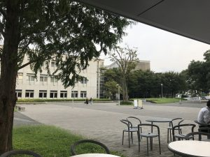

# 雑記（2017年9月13日）
ロボット学会二日目。良い天気でした。 
 
 
 
<h3>ロボット学会の登壇</h3> 
 
いつもの雑談を挟んで最後時間が足りなくなるやつが発動。おまけに、発表の内容が記憶からの行動決定だったので、「こうやって雑談してると最後まで発表が終わらないとか、人間はそういうことを考えて行動を調整するわけです。」と前振りまでやってこのザマ。普段学生様にご指導いたす立場として誠に面目無い。 
 
 
もう1分1枚にこだわらずに1分半で1枚にすることにする。 
 
 
<blockquote class="twitter-tweet" data-lang="ja">
「確率ロボティクスの先生だー！」 じゃなくて、 「いつもTLをうんこで埋め尽くしてる先生だー！」 ってなってる。
&mdash; Kazumi Kumagai (\@kazumi_kumagai) <a href="https://twitter.com/kazumi_kumagai/status/907811415313997824">2017年9月13日</a></blockquote>  
 
日頃の行い。 
 
<h3>新井研OB飲み</h3> 
 
行こうとしたバルが本川越なのに川越駅に集合。たぶん情報理工の人たちはこういうミスはおこさないんでなかろうか？（完全に偏見） 
 
入ろうとした居酒屋の前で、その居酒屋の呼び込みに口説かれて拒否してしまうという逆呼び込み現象を経験。 
 
テーマは脂ぎる中小企業の世界など。そして世の中の多くの担々麺にピーナツが入っているという事実を教えられる。ピーナツアレルギーとしては控えざるを得ない。締めに食ったラーメンは担々麺だった。 
 
<h3>LINE</h3> 
 
電話番号きかれてアカウント作るのやめるということを何回も繰り返してたが、執筆のためにとうとう電話番号を教えてしまう。なお、Instagramと同様、使うつもりがあまりない。けど使うかもしれない。 
 
 
まもなく和光市。とんかつ和幸。
