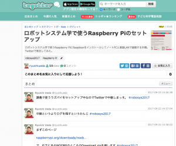

# 講義資料をTwitterとまとめサイトで作ってみた
久しぶりに雑記じゃない記事。今日はこういうことをした。 
 
<blockquote class="twitter-tweet" data-partner="tweetdeck">
講義資料をまとめサイトで作ってみたけど世界初だろうか？ | ロボットシステム学で使うRaspberry Piのセットアップ - Togetterまとめ <a href="https://t.co/K7Xjnbzk06">https://t.co/K7Xjnbzk06</a> <a href="https://twitter.com/togetter_jp">\@togetter_jp</a>さんから <a href="https://twitter.com/hashtag/robosys2017?src=hash">#robosys2017</a>
&mdash; Ryuichi Ueda (\@ryuichiueda) <a href="https://twitter.com/ryuichiueda/status/911579158911664128">September 23, 2017</a></blockquote> 
 
 
インストール手順は色々地雷があるのでこのような一本道ツイートだと全部網羅できないけど、質問があったら当該のツイートにリプくれという感じになるので、案外いいかもしれない。変にパワポを作るよりも。もちろんパワポより手間はかかりません。 
 
今、遠隔授業ってビデオ撮影が主流だったりするけど、Twitterで実況するのも十分アリだと思う。今度声が出なくなってしまった時に教壇の上からやってみたい。あるいは学会の会場からやるとか。多分規則的にダメだけど。 
 
 
 
しかし、講義というイメージの正反対にありますな・・・。しかし10年後はだいたいこんな感じかもしれない（適当）。 
 
皆さんもやってみてくださーい。 
 
 
ちょっと本を書いて寝る。
