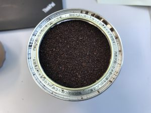
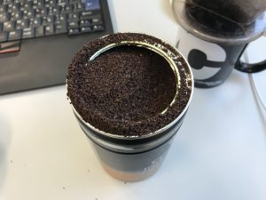

# 雑記（2017年9月26日）
<h3>ソフトウェアデザイン</h3>
完読を目指していて不意を突かれる。

<blockquote class="twitter-tweet" data-lang="ja">
な、なんじゃこりゃあ！！！wwwwwww<a href="https://twitter.com/hashtag/gihyosd?src=hash">#gihyosd</a> 10月号 <a href="https://t.co/FxSbJDbTwK">pic.twitter.com/FxSbJDbTwK</a>
&mdash; Ryuichi Ueda (@ryuichiueda) <a href="https://twitter.com/ryuichiueda/status/912290811408113664">2017年9月25日</a></blockquote> 

小林さんのレポート、名文でした。（またお願いしたいです。）

<blockquote class="twitter-tweet" data-lang="ja">
「容赦なく環境を破壊して研究する大阪」 <a href="https://twitter.com/hashtag/%E3%82%B7%E3%82%A7%E3%83%AB%E8%8A%B8?src=hash">#シェル芸</a> <a href="https://twitter.com/hashtag/%E5%A4%A7%E9%98%AA?src=hash">#大阪</a> <a href="https://twitter.com/hashtag/%E7%A0%B4%E5%A3%8A?src=hash">#破壊</a> <a href="https://twitter.com/hashtag/%E5%8D%B1%E9%99%BA?src=hash">#危険</a>
&mdash; Ryuichi Ueda (@ryuichiueda) <a href="https://twitter.com/ryuichiueda/status/912292772555636736">2017年9月25日</a></blockquote> 

↓買いましょう。

<a href="http://www.amazon.co.jp/exec/obidos/ASIN/B0743485MX/ryuichiueda-22/" target="_blank" >ソフトウェアデザイン 2017年 10 月号 [雑誌]</a>
posted with <a href="http://kaereba.com" rel="nofollow" target="_blank">カエレバ</a>

 技術評論社 2017-09-16    

<a href="http://www.amazon.co.jp/gp/search?keywords=%E3%82%BD%E3%83%95%E3%83%88%E3%82%A6%E3%82%A7%E3%82%A2%E3%83%87%E3%82%B6%E3%82%A4%E3%83%B3&__mk_ja_JP=%E3%82%AB%E3%82%BF%E3%82%AB%E3%83%8A&tag=ryuichiueda-22" target="_blank" >Amazonで調べる</a>

<a href="https://hb.afl.rakuten.co.jp/hgc/160ef62b.67679dda.160ef62c.1fcc3769/?pc=http%3A%2F%2Fsearch.rakuten.co.jp%2Fsearch%2Fmall%2F%25E3%2582%25BD%25E3%2583%2595%25E3%2583%2588%25E3%2582%25A6%25E3%2582%25A7%25E3%2582%25A2%25E3%2583%2587%25E3%2582%25B6%25E3%2582%25A4%25E3%2583%25B3%2F-%2Ff.1-p.1-s.1-sf.0-st.A-v.2%3Fx%3D0%26scid%3Daf_ich_link_urltxt%26m%3Dhttp%3A%2F%2Fm.rakuten.co.jp%2F" target="_blank" >楽天市場で調べる</a>

<h3>コーヒー缶に計量スプーン埋没</h3>

埋没。

このあと、Facebookでどう計量スプーンを取り出すか大喜利開始。<a href="https://ja.m.wikipedia.org/wiki/%E3%83%96%E3%83%A9%E3%82%B8%E3%83%AB%E3%83%8A%E3%83%83%E3%83%84%E5%8A%B9%E6%9E%9C" rel="noopener" target="_blank">ブラジルナッツ効果</a>を利用したらどうかと提案いただく。

結果、以下のように粉が缶の縁にモリモリ乗っかった挙句、スプーンは出現せず。

訴訟に発展。

<h3>講義の準備</h3>

明日の講義の準備。ロボットシステム学は手間を減らし、学生さんが印刷したりダウンロードしたりできるようにスライドをやめて<a href="https://github.com/ryuichiueda/robosys2017/blob/master/02.md" rel="noopener" target="_blank">GitHubのマークダウン</a>に。<a href="https://lab.ueda.tech/?presenpress=%E7%A2%BA%E7%8E%87%E3%83%AD%E3%83%9C%E3%83%86%E3%82%A3%E3%82%AF%E3%82%B92017%E7%AC%AC2%E5%9B%9E#/" rel="noopener" target="_blank">確率ロボティクス</a>は式があるのでスライドがやめられないが、宣言通りJupyter notebookを使う予定。

少し本書いて寝る。
