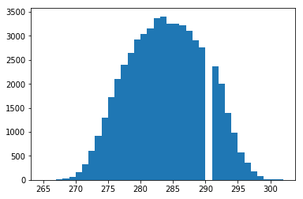

# URG（あるいはROSのurg_node）の謎

センサデータのばらつきの解説を書くためにURG（URG-04LX-UG01）の出力から1点だけ取り出して2日にわたって記録するということをやっていたら、この値が決して290[mm]にならないというニッチなことを発見しました。もちろん実用上は何の問題もないはずですが・・・

ヒストグラムを書いたらすごく綺麗なガウス分布の一箇所だけが欠けます。URGの出すデータに問題があるのか、ROSのノードが出してくるデータに問題があるのかは分かりません。自分の端数処理が悪いのかと疑いましたが、トピックから採取したデータを `sort | uniq` したら、確かに欠けていました。

検証した時のデータとコードはここにあります。

* https://github.com/ryuichiueda/LectureOfProbabilisticRobotics/blob/master/sensor_data/sensor_data.ipynb

解説、どうやって書こう・・・というところですが、ロボットの業界はこういうことに対処してナンボだと思います。綺麗なデータを使ってシミュレーションしても実機で動かないのが普通ですから・・・。

どなたか何かご存知でしたら教えていただければと・・・。

