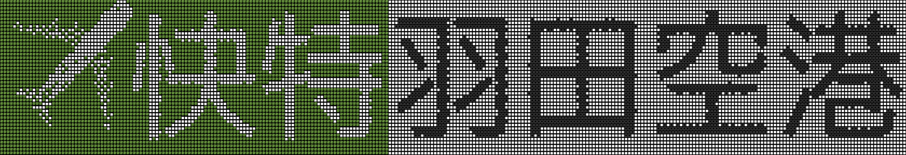

# 【問題と解答】jus共催 第42回BLACK HOLEシェル芸勉強会


* 問題で使われているデータファイルは[GitHub](https://github.com/ryuichiueda/ShellGeiData/tree/master/vol.42)にあります。クローンは以下のようにお願いします。
* もっと良い解答例がTwitter上にあります。

```bash
$ git clone https://github.com/ryuichiueda/ShellGeiData.git
```


* 環境: 解答例はUbuntu Linux 18.04 で作成。Macの場合はcoreutilsをインストールすると、GNUのコマンドが使えます。BSD系の人は玄人なので各自対応のこと。

## Q1

正の整数の組\((x,y,z)\)について、\(x+xy+xyz=1234\), \(x \lt y \lt z\)を満たす組み合わせを全て選んでください。

（2019年の日本数学オリンピックの予選問題を少し変更）


## Q2

次のファイルの文章内の絵文字を全て💩に変えてください。多少結果が雑になっても構いませんので色々解答を考えてみましょう。

```
$ cat oji
あれ(^_^;さのチャン、朝と夜間違えたのかな❗❓⁉俺はまだ起きてますよ〜😃 ちょっと電話できるかナ（￣ー￣?）⁉天気悪いと気分もよくないよね😱じゃあ今日は会社休んで俺とデートしヨウ💕ナンチャッテ🎵（笑）😘
```

## Q3

次のような出力を完成させてください。右側の文字列は`matsuya`コマンドから生成したものですが、別のジェネレータ系のコマンドでも構いません。

```
2: きつねうどん
3: ブラウンソース定食
4:
5: 鉄皿ブラウンソースハンバーグセット
6:
7: きつねうどん　ミニプレミアムおろしポン酢牛めしセット
8:
9:
10:
11: 鉄皿ブラウンソースライス
12:
13: 担々うどん（プレミアム牛肉使用）
14:
15:
16:
17: とろたまうどん　ミニポン酢ポン酢牛めしセット
18:
19: 豚カルビ丼
20:
```
## Q4

数字を打たずに`3`を出力してください。

## Q5

アルファベットを打たずに`ls`を実行してください。


## Q6

次のワンライナーは京急のエアポート快特羽田空港行きの表示を出力するものですが、残念ながら飛行機の向きが逆です。（実際は左上を向いている。）

（環境によっては飛行機が右向きに真横に向くことがありますが、その場合は左に真横に向けてください。）

```
echo ✈︎快特羽田空港 |sed -r 's/(.)./\1/' |
textimg -F40|convert - -compress none pbm:- |
tail -n +3|tr -d ' '|sed -r 's/.{120}/&\n/'|
sed -e '1~2s/0/■/g' -e '1~2s/1/🍀/g'  -e '2~2,$s/0/□/g' -e '2~2,$s/1/■/g'|
xargs -n 2 | tr -d ' ' |textimg > a.png
```





## Q7

次のワンライナーは、素数をスペース区切りで出力するものです。

```
$ seq 1000000 | factor | awk 'NF==2{print $2}' | tr \\n ' ' 
```

ここからパイプをつなげて、素数の桁が変わる直前のところで改行を入れてください。つまり、桁数ごとに素数を1行に並べて出力してください。なお、`awk`、`perl`、`ruby`などのプログラミングできるコマンドやbashの`for`や`while`などの制御構文を用いて出力できた場合は、それらを使わずに出力してみてください。`sed`は可とします。

次のように確かめるとデバッグしやすいです。

```
$ seq 1000000 | factor | awk 'NF==2{print $2}' | （解答） | awk '{print $1,$NF}'
2 7
11 97
101 997
1009 9973
10007 99991
100003 999983
```

## Q8

これをなるべく忠実に作ってみてください。


