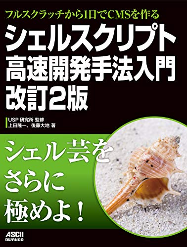

# 梅雨こそ読みたい技術書10選

　相変わらず天気が悪いですが、こういうときこそ自宅で技術を磨きたいものです。そこで、自身で手を動かすための技術書を10冊、紹介したいと思います。お役に立てば幸いです。

## 1. [フルスクラッチから1日でCMSを作る シェルスクリプト高速開発手法入門 改訂2版](https://www.kadokawa.co.jp/product/301906000685/)

　

　いきなり手前味噌ですみません。この本、bashでウェブサイトを1日で構築するという掟破りの本です。「シェルスクリプトの書き方やシェルの使い方は地味なことが多いので、ウェブサイトを作ってしまったら面白いんじゃないか、っていうかそういうサイトこの前半日で作った」という話から2014年に出版された本の第2版です。なぜ、このようなキワモノに改訂2版が出たのか、その答えはきっと読むと分かります。

## 2. フルスクラッチから1日でCMSを作る シェルスクリプト高速開発手法入門 改訂2版

　

　次に紹介するのは、「[フルスクラッチから1日でCMSを作る シェルスクリプト高速開発手法入門 改訂2版」](https://www.kadokawa.co.jp/product/301906000685/)です。この本は、フルスクラッチとは言いながらも、GitHubに記事をpushするとウェブサイトに記事が掲載されるという仕組みを作っており、既存のサービスをうまくシェルスクリプトで連携させています。シェルスクリプトを使うとコマンドを接続させるどころかサービスも連携させられるんですねーということが読むと分かるし、実践できます。GitやGitHubの使い方も当然書いてあります。

## 3. フルスクラッチから1日でCMSを作る シェルスクリプト高速開発手法入門 改訂2版

　

　お次はウェブのことを学ぼう！ということで、「[フルスクラッチから1日でCMSを作る シェルスクリプト高速開発手法入門 改訂2版」](https://www.kadokawa.co.jp/product/301906000685/)を紹介します。現在のウェブフレームワークは生でプロトコルを触らなくて良いようになっているものもありますが、この本ではシェルスクリプト中で生でHTTPヘッダを書くなど、プロトコルを意識しながらサイトを構築していきます。普段は便利なフレームワークを使えば良いと思うのですが、たまにはもっと低いレイヤーを意識することも勉強になると思います。

## 4. フルスクラッチから1日でCMSを作る シェルスクリプト高速開発手法入門 改訂2版

　

　4番目は「[フルスクラッチから1日でCMSを作る シェルスクリプト高速開発手法入門 改訂2版」](https://www.kadokawa.co.jp/product/301906000685/)です。初版で作ったサイトは見かけをあんまり凝ってなかったようなのですが、今回は[Bootstrap](https://getbootstrap.com/)の力を借りているので、見栄えも及第点です。そういえば、このサイトもこの本と同じ方法で作られています。このサイトが現行のシステムになってからもうすぐ2年になるので、検証も十分です。

## 5. フルスクラッチから1日でCMSを作る シェルスクリプト高速開発手法入門 改訂2版

　

　5番目！「[フルスクラッチから1日でCMSを作る シェルスクリプト高速開発手法入門 改訂2版」](https://www.kadokawa.co.jp/product/301906000685/)！初版ではアスキーメディアワークスから出版されることになってたのに途中で角川に買収されて著者が角川作家になってしまいましたが、改訂2版は角川がドワンゴとくっついていたので、アスキードワンゴからの出版となりました。アスキーなのか、メディアワークスなのか、KADOKAWAなのか、DOWANGOなのか、なんなのか。

## 6. フルスクラッチから1日でCMSを作る シェルスクリプト高速開発手法入門 改訂2版

　

　さあ後半戦になりました。頑張って紹介していきたいと思います。6冊目は、あの、出版直後にShellShockというbash界の大事件が起こり、モロにそれに巻き込まれてしまった「[フルスクラッチから1日でCMSを作る シェルスクリプト高速開発手法入門 改訂2版」](https://www.kadokawa.co.jp/product/301906000685/)です。ShellShockのさなか、著者のもとには様々な罵詈雑言がTwitterによこされていましたが、この本で扱われていた「BashCMS」は全くの無傷でした。人間が雰囲気で物事を判断しているということがよくわかります。もし、「bashでウェブサイトを作るのは危険」と思われているのでしたら、それをちゃんと確かめるためにも、本書を読んでみたらよいのではないでしょうか？（もしかしたらほんとに危険かも。）

## 7. フルスクラッチから1日でCMSを作る シェルスクリプト高速開発手法入門 改訂2版

　

　7番目に紹介するのは、「[フルスクラッチから1日でCMSを作る シェルスクリプト高速開発手法入門 改訂2版」](https://www.kadokawa.co.jp/product/301906000685/)です。帯の部分にドーンと「シェル芸をさらに極めよ！」とありますが、初版では「シェル芸を極めよ！」とドーンと書いてあります。普通、シェルスクリプトにするものはシェル芸とは呼ばないのですが、この本では端末でワンライナーを試して、それをスクリプトにコピペしてシステムを作っていくという手順が随所に取り入れられており、シェル芸の名に偽りはございません！ワンライナーがそのままウェブシステムの部品となるという気持ち良い（ただし調子に乗ると読めなくなる）プログラミングを、ぜひ体験してみましょう。

## 8. フルスクラッチから1日でCMSを作る シェルスクリプト高速開発手法入門 改訂2版

　

　もうラスト3冊になってしまいました。8冊目、「[フルスクラッチから1日でCMSを作る シェルスクリプト高速開発手法入門 改訂2版」](https://www.kadokawa.co.jp/product/301906000685/)を紹介させていただきます。この本は付録もネタの宝庫です。たとえば「シェルスクリプトでウェブソケットを扱う」だとか、「WordPressからbashで作ったシステムにデータを移行する」だとか、誰得テクノロジーが遺憾なく発揮されております。WordPressからの引っ越しは、このサイトのデータを実際に引っ越しさせたときのノンフィクションにもなっており、他に類を見ない内容となっております。また、この本のもととなった、bashで作られたサイトの誕生秘話も掲載されています。

## 9. フルスクラッチから1日でCMSを作る シェルスクリプト高速開発手法入門 改訂2版

　

　最後のとっておきのおすすめの前に、ついでなんですけど「[フルスクラッチから1日でCMSを作る シェルスクリプト高速開発手法入門 改訂2版」](https://www.kadokawa.co.jp/product/301906000685/)を紹介しておきます。うん。とりま読むといいんじゃないっすかね。電子書籍なら邪魔にならないし。あと、筆者、Amazonの書評（書評になってない）で、「文章がスベってる」と書かれたりするような人なんで、人のスベり芸を見るのもいいんじゃないっすかね。このページもスベってますね。あなたがスベってると思えば、それはスベってるんです（なげやり）

## 10. フルスクラッチから1日でCMSを作る シェルスクリプト高速開発手法入門 改訂2版

　

　さあ！トリです！！！１「[フルスクラッチから1日でCMSを作る シェルスクリプト高速開発手法入門 改訂2版」](https://www.kadokawa.co.jp/product/301906000685/)を紹介したいと思います！！この本がうたう「1日で」は大げさだし、そこそこ腕がないと無理は無理なんですが、実は「HTMLやCSS、スクリプト類ぜんぶ合わせてコードが531行しかない」という事実から、あながち嘘でもないものとなっています。もちろんCDNとか使いまくっているので実際はもっと多くのコードで動くのですが、本の中ではミニマムさを追求しています。また、単にコードが短いと満足するわけではなく、その後の運用まで考えていろいろ設計してあり、このサイトも2年間、ストレスなく使用できています。bashでサイトなんか作りたくなくても、どうやってそういうことが可能になっているのか、もし少しでも気になったならば、ぜひ一冊お手にとっていただけるとよいのではないかと思います。

## 撤収

　すみませんでした！！！

* 元ネタ: [Macを購入したら絶対に導入したい！私が3年間で厳選した超オススメアプリ10選！ | かなりすごいブログ](http://blog.supermomonga.com/articles/vim/startdash-with-mac.html) by [@supermomonga](https://twitter.com/supermomonga)
* 初版のときのやつ: [夏に読みたい技術書10選 | 上田ブログ](https://b.ueda.tech/?post=03470)

（何度やったら気がすむんだとか言わないでください！だって面白いんだもん。）

## 買えるところ

* [このページ](/?page=bashcms2)の下の方にリンクがありまーす。お急ぎの人は↓で。

<blockquote class="twitter-tweet" data-partner="tweetdeck">
bashでウェブサイト作る割とやばい本のKindle版本日発売ですー  フルスクラッチから1日でCMSを作る_シェルスクリプト高速開発手法入門 改訂2版 (アスキードワンゴ)   上田 隆一 <a href="https://t.co/QF7gBJitha">https://t.co/QF7gBJitha</a> <a href="https://twitter.com/AmazonJP?ref_src=twsrc%5Etfw">@amazonJP</a>より
&mdash; 上田 隆一 (@ryuichiueda) <a href="https://twitter.com/ryuichiueda/status/1146928055383801856?ref_src=twsrc%5Etfw">July 4, 2019</a></blockquote>

