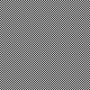

# 【問題のみ】jus共催 第43回大暴れシェル芸勉強会


* 問題で使われているデータファイルは[GitHub](https://github.com/ryuichiueda/ShellGeiData/tree/master/vol.43)にあります。クローンは以下のようにお願いします。

```bash
$ git clone https://github.com/ryuichiueda/ShellGeiData.git
```


* 環境: 解答例はUbuntu Linux 18.04 で作成。Macの場合はcoreutilsをインストールすると、GNUのコマンドが使えます。BSD系の人は玄人なので各自対応のこと。


## Q1

　`echo あいうえお`から始めて次のように出力してください。

```
あいいうううええええおおおおお
```

## Q2

　たかし君は1個11円のうまい棒と1個21円のチロルチョコと1個54円のよっちゃんイカを223円分購入しました。それぞれいくつずつ購入したでしょうか？それぞれ最低一個は購入しているものとします。


## Q3

　次の10進数表現されたIPアドレスを2進数32桁に変換してください。できた人は逆変換の方法も考えてみてください。

```
192.168.10.55
```

## Q4

　双子素数を出力していってください。双子素数とは、差が2となる素数のペアのことです。

```
3 5
5 7
11 13
・・・
```

## Q5

　1から9の整数の組み合わせで、足して10になり、互いに数字が異なる組み合わせ（順番を入れ替えたものを含む）を全て列挙してください。


## Q6

　次の`nums`ファイルについて、Q5のような数字の並びになっている部分を、何行目に存在したかと共に出力してください。

```
$ cat nums
124123541
321412412
352381324
124214535
433251244
```

## Q7

　次のような100x100ピクセルのビットマップファイルを作ってください。




## Q8

　`check.bmp`を何か文字列をワンライナーで仕込んだビットマップに変換し、ビットマップからその文字を抽出して端末に表示してみてください。文字列を仕込んだビットマップは画像として開けることを確認のこと。

## Q9

　さらに、文字列を仕込んだビットマップをpng形式にして、さらにそれをビットマップに復元して仕込んだ文字が読めることを確認してください。


