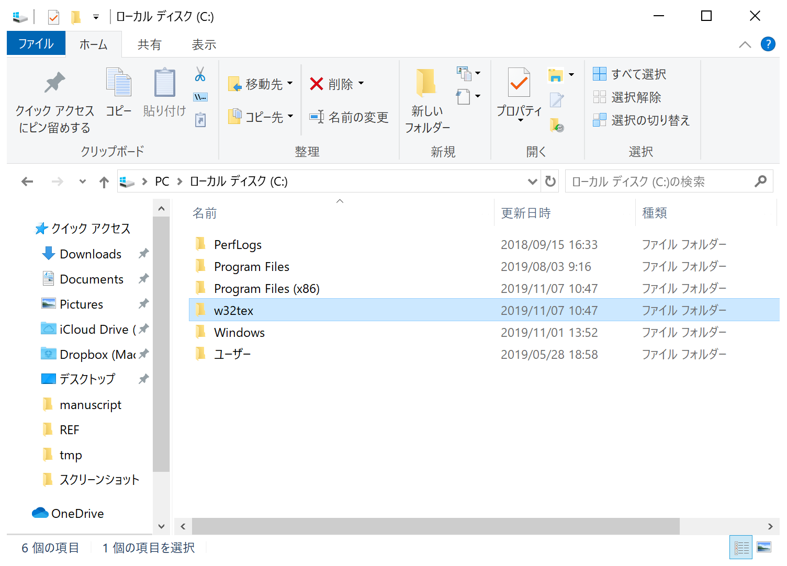
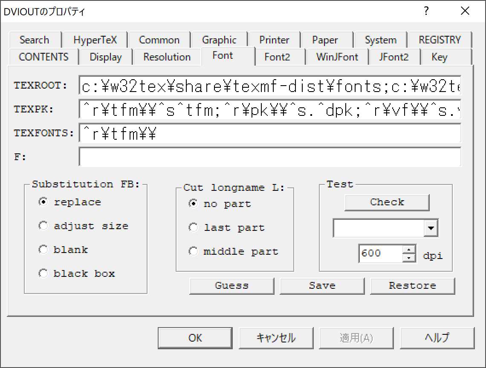
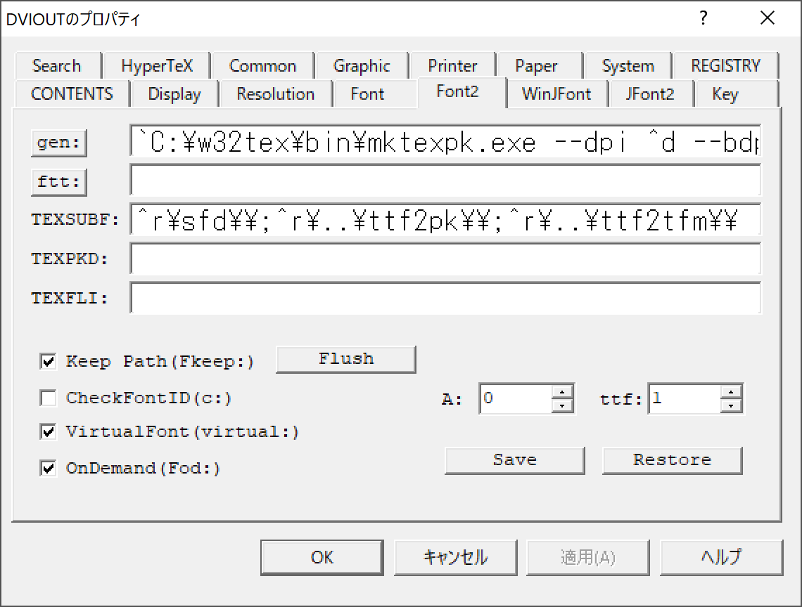
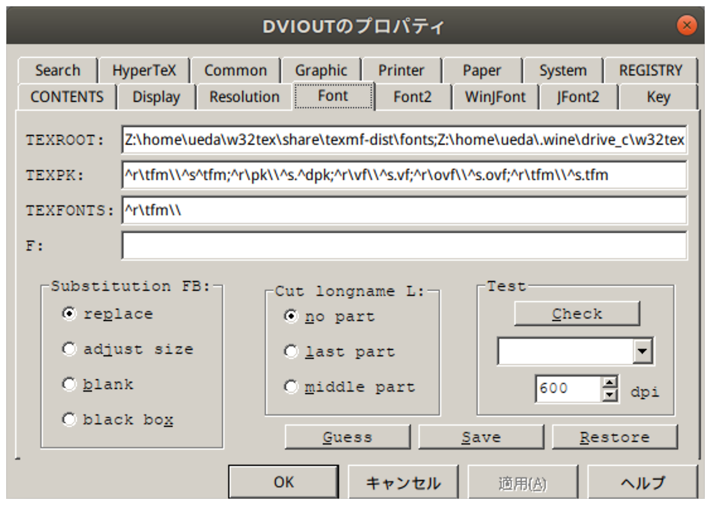
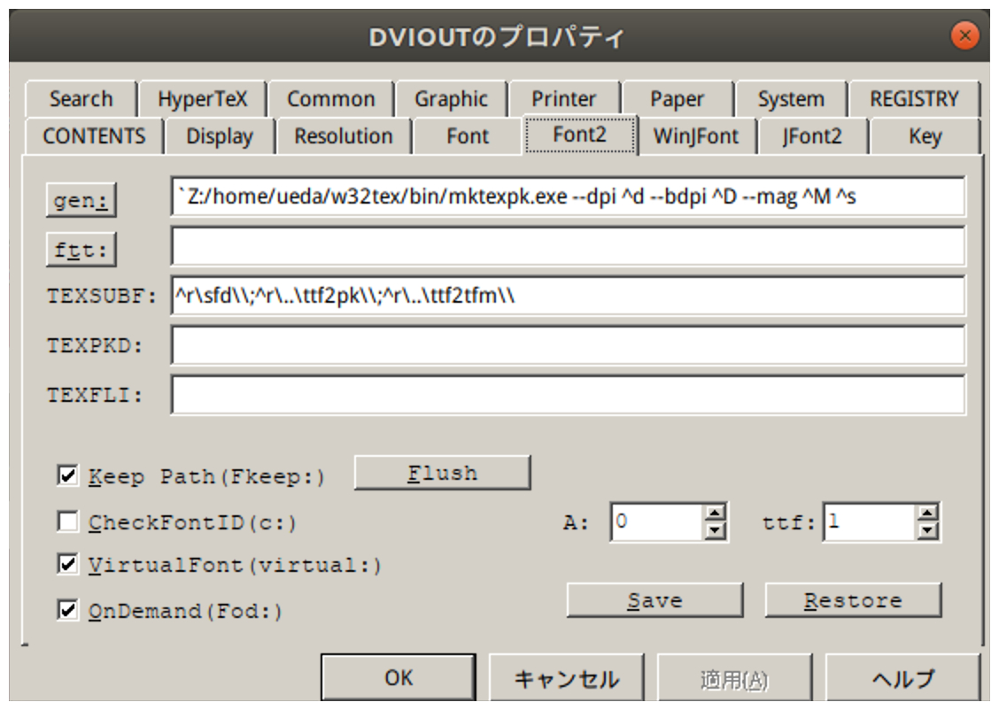
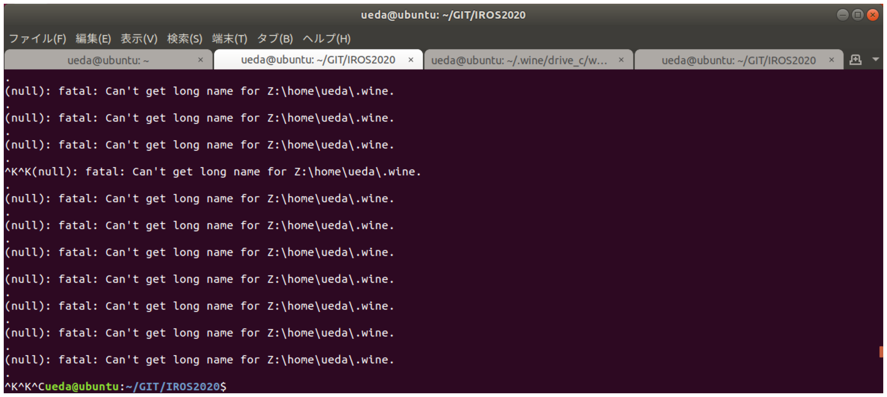

# dviout on wine on Ubuntu

　dvioutがどうしてもUbuntuで使いたくて、wineを使ってインストールしました。粗い手順とハマったところをメモします。

## WindowsにW32TeXをインストール

　まず、適当なWindowsのマシン（私の場合はMacの上の仮想マシン）に、[TeXインストーラ3](https://www.ms.u-tokyo.ac.jp/~abenori/soft/abtexinst.html)を使ってdvioutなどTeXのソフト一式をインストールします。これで、日本語のドキュメントと英語のドキュメントがdvioutで問題なく閲覧できるように設定します。

　その後、下図の`C:\w32tex`をzipか何かで固めてUbuntuに持っていきます。



## wineのディレクトリにW32TeXを展開

　次に、wineのCドライブのディレクトリ（素直にインストールしてあれば`~/.wine/drive_c/`）の下に、`w32tex`を展開します。

```
ueda@ubuntu:~/.wine/drive_c$ ls w32tex/
bin  bin64  download  dviout  harftex-w32.txt  harftex-w64.txt  share
```

## ホームにシンボリックリンク

　で、ここがミソですが、ホームに`w32tex`のシンボリックリンクを作ります。

```
$ cd
$ ln -s .wine/drive_c/w32tex/ w32tex
```

<span style="color:red">これをやらないと後で超絶ハマるかもしれません。</span>


## dvioutの設定

　で、次にdvioutを立ち上げます。

```
$ wine ~/w32tex/dviout/dviout.exe 
```

そして、「Option」→「Setup Parameters」でフォントの設定をします。押したら自動設定してくれるボタンがありますが、ファイルが多いマシンでやると終わりません。手動で設定します。

　Windowsでは「Font」と「Font2」が次のように設定されています。




この`TEXROOT`と`gen:`について、 `C:\`を`Z:\home\<ユーザ>\`に変更します。私の環境の場合はつぎのようになります。





　あとはその他の設定をします。

* 自分の例
  * Resolution -> resolution: 600dpiに変更
  * System -> raster buffer size: 4000K byteに変更
  * System -> font buffer size: 4000K byteに変更


　これで、日本語の原稿と英語の原稿をコンパイルして、たとえば

```
$ wine ~/w32tex/dviout/dviout.exe iros2020.dvi 
```

のように`dviout.exe`の後ろにdviファイルを指定してやると、たぶんフォントが生成されてちゃんと表示されるはずです。

<blockquote class="twitter-tweet" data-partner="tweetdeck"><p lang="ja" dir="ltr">できたー！！！！（dviout on wine on Ubuntu on Mac） <a href="https://t.co/49Om6JNCs6">pic.twitter.com/49Om6JNCs6</a></p>&mdash; 上田 隆一 (@ryuichiueda) <a href="https://twitter.com/ryuichiueda/status/1192364228641841152?ref_src=twsrc%5Etfw">November 7, 2019</a></blockquote>
<script async src="https://platform.twitter.com/widgets.js" charset="utf-8"></script>


## ハマったポイント

　最初、シンボリックリンクを作らずにdvioutに`Z:\.wine\drive_c\w32tex...`というようにパスを設定していたのですが、これだとパスがうまく認識できず、次のようにエラーが出ました。



エラーを読まない人だとここで詰むと思うのですが、幸い、学生に一時間ごとに「ログを読め💢」と言わなければいけない職業なので、ちゃんとログを読んでました。いつも怒っていることがほんの少しだけ報われたような気がしますが、学生さんはちゃんとログ読んでください。ていうか読め。


以上です。
