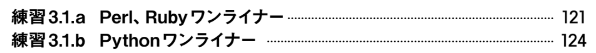

# 今度出るシェル芸本の二面性が激しい1

　そろそろシェル芸勢で書いたこの本↓に関して自分なりに ~~セコくアフィリエイト~~ 販促活動しなければいけないなーという記事です。（[アフィリエイトじゃないリンク](https://gihyo.jp/book/2021/978-4-297-12267-6)）

  

    

      
    

    

      

        <dl class="fn" style="font-size:80%">
          <dt><a href="https://www.amazon.co.jp/dp/4297122677?tag=ryuichiueda-22&linkCode=ogi&th=1&psc=1">1日1問、半年以内に習得 シェル・ワンライナー160本ノック</a></dt>
          <dd>上田 隆一, 山田 泰宏, 田代 勝也, 中村 壮一, 今泉 光之, 上杉 尚史</dd>
          <dd>技術評論社 2021-09-27</dd>
        </dl>
      

    

  

　まだ全貌が明らかになっていないのでアレですが、この本は、特に学生さんが今後数十年とコンピュータと付き合っていくことを考えると、一生にわたって役に立つ本だと思います。大学でカリキュラムとして（つまり学問として）これを押し付けるのはちょっと無理なんですが、自由にやっていいならば、まず学生さんはこれを、という内容になっています。まずはこれくらいコンピュータを **「操縦」** できるようになってからの方が、小難しい理屈も分かりやすいはずです。もちろん、どれだけ年配の方にとっても、「今後数十年」は成り立つ話なので、学生さんに限った話ではありません。カバーする領域についても、共著者の得意分野がバランスよく配合されています。

## なんだけど変態本でもある

　一方、この本は変態度がかなり高い面もあります。「操縦」と書いたとおり、 **安心安全なパイロットになるには、仕事ではやらない曲芸（危険）飛行もできないとアカンだろう** という内容になっています。そのため、固定観念のない学生さんが「ふーん」と思ってそのまま吸収することであっても、そこそこ業界で知識のある人にとっては「なんじゃこりゃあああああ！」という変態行為が本の中に散在しています。そのため、購入後に「頭がおかしくなった通院費払え」「マシンが家ごと爆発したから弁償しろ」などと言われる可能性が若干あります。

　そこで、経験者向けにこのページで目次とか索引とかをチラ見せして、発売前から牽制・威嚇（？）をしようと思いました。このページで何回かやろうと思います。ちゃんと技評さんにチラ見せの許可をとってます。

## 今回のチラ見せ

　で、第一回は目次から2行だけ抜粋してお見せします。前置きが長かったんですけど、これ見せたら満足なので終わります。

　たぶん、Pythonワンライナーを扱う本はそんなにない（ない）という認識なので、 **もしPythonワンライナーに興味があれば、たぶん今から予約してもいいんじゃないかなー** ということで、終わります。いるのかそんな奴？

  

    

      
    

    

      

        <dl class="fn" style="font-size:80%">
          <dt><a href="https://www.amazon.co.jp/dp/4297122677?tag=ryuichiueda-22&linkCode=ogi&th=1&psc=1">1日1問、半年以内に習得 シェル・ワンライナー160本ノック</a></dt>
          <dd>上田 隆一, 山田 泰宏, 田代 勝也, 中村 壮一, 今泉 光之, 上杉 尚史</dd>
          <dd>技術評論社 2021-09-27</dd>
        </dl>
      

    

  

疑問があればなるべくTwitterでお受けできますので、よろしくお願いいたしまっす。以上です。
