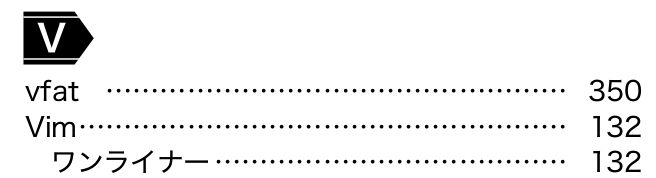

# シェル芸本が出るよ2

　↓この本に関する記事第二回です。タイトルは前回「[今度出るシェル芸本の二面性が激しい1](/?post=20210902)」だったのですが、いまいちキャッチーじゃないので変えました。

  

    

      
    

    

      

        <dl class="fn" style="font-size:80%">
          <dt><a href="https://www.amazon.co.jp/dp/4297122677?tag=ryuichiueda-22&linkCode=ogi&th=1&psc=1">1日1問、半年以内に習得 シェル・ワンライナー160本ノック</a></dt>
          <dd>上田 隆一, 山田 泰宏, 田代 勝也, 中村 壮一, 今泉 光之, 上杉 尚史</dd>
          <dd>技術評論社 2021-09-27</dd>
        </dl>
      

    

  

## 今日のチラ見せ

　で、今日は13ページもある索引からチラ見せということで、次の画像を掲載します。

Vim・・・ワンライナーですね。ということはVimワンライナー愛好家には必携の一冊になる！けどそんな奴いるのか？（注意: ちょっとしか出てきません！）

以上。
