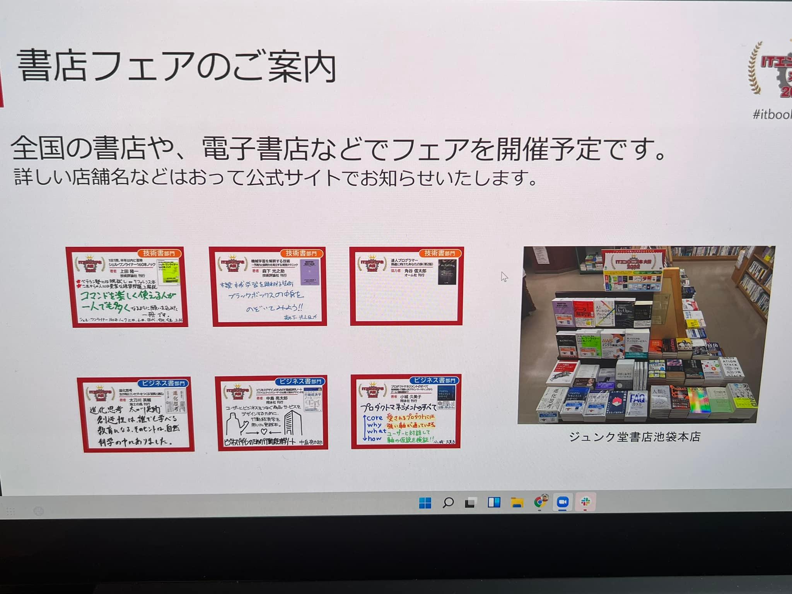

# ITエンジニア本大賞のプレゼンをしてきました

　「[シェル・ワンライナー160本ノック](https://gihyo.jp/book/2021/978-4-297-12267-6)」が
ITエンジニア本大賞技術書部門の候補3冊に選ばれましたので、
2月17日に[Developers Summit 2022（デブサミ）](https://event.shoeisha.jp/devsumi/20220217)
で選考プレゼンに登壇してきました。
登壇してきましたと言ってもオンラインです。
けっこう盛り上がるらしいので残念ですが、
スタッフの皆さんが入念にオンラインでの段取りをチェックされており、
大きなイベントなんだなということを知ることができました。
本をアピールする場をいただいて感謝です。

## 結果

　で、3冊から大賞と審査員特別賞を選ぶプレゼンだったわけですが、
どちらも「[達人プログラマー](https://www.ohmsha.co.jp/book/9784274226298/)」が受賞ということで、
「シェル・ワンライナー160本ノック」は無冠でした。
残念ですが、デブサミというイベントの性格上、
前から予想はついてました。
賞をとりにいくというよりは、
普段リーチできない界隈に「こういうのもあるよ」
と紹介しに行くというつもりでプレゼンしました。

## プレゼン内容

　こういうスライドを使いました。

<iframe src="//www.slideshare.net/slideshow/embed_code/key/GmFqG1lVLGRBEo" width="595" height="485" frameborder="0" marginwidth="0" marginheight="0" scrolling="no" style="border:1px solid #CCC; border-width:1px; margin-bottom:5px; max-width: 100%;" allowfullscreen> </iframe> 
 <strong> <a href="//www.slideshare.net/ryuichiueda/160-251192233" title="シェル・ワンライナー160本ノック" target="_blank">シェル・ワンライナー160本ノック</a> </strong> from <strong><a href="//www.slideshare.net/ryuichiueda" target="_blank">Ryuichi Ueda</a></strong> 

余裕があればプレゼンを録り直してYouTubeにでもアップしたいです。
「シェル芸勉強会の集大成である」というスライドを
もうちょい内容が詰め切れなかったかなというのが反省点です。

## 宣伝

　全国の書店や電子書店で本賞のフェアを開催予定/開催中とのことです。

<blockquote class="twitter-tweet" data-partner="tweetdeck">
【再掲】フェア情報：6F上りエスカレータ前にて『ITエンジニア本大賞2022』フェアを開催中。ITエンジニアがWeb投票した“おすすめ書籍”から、上位10冊ずつの「技術書・ビジネス書各ベスト10」と特別ゲストのおすすめ本、そして先日発表された2022大賞の書籍を集めました。 <a href="https://t.co/YQsSLxSvjQ">pic.twitter.com/YQsSLxSvjQ</a>
&mdash; ジュンク堂書店池袋本店 PC書担当 (@junkudo_ike_pc) <a href="https://twitter.com/junkudo_ike_pc/status/1494856584996225028?ref_src=twsrc%5Etfw">February 19, 2022</a></blockquote>

<blockquote class="twitter-tweet" data-partner="tweetdeck">
【３階】エンジニアの皆様に読んでほしい技術書・ビジネス書をえらぶITエンジニア本大賞が決定<a href="https://t.co/ZTUvOi7oJR">https://t.co/ZTUvOi7oJR</a>　！３階では、技術書部門・大賞受賞作『達人プログラマー 熟達に向けたあなたの旅』<a href="https://t.co/F1P3Txz1il">https://t.co/F1P3Txz1il</a>　をはじめ、技術書部門ベスト10を集めたコーナーを展開中です。 <a href="https://t.co/OIDZyfhpAp">pic.twitter.com/OIDZyfhpAp</a>
&mdash; 八重洲ブックセンター本店 (@yaesu_honten) <a href="https://twitter.com/yaesu_honten/status/1494494548256444416?ref_src=twsrc%5Etfw">February 18, 2022</a></blockquote>

<blockquote class="twitter-tweet" data-partner="tweetdeck">
【8階PC】本日より 「ITエンジニア本大賞2022  <a href="https://twitter.com/ITbookaward?ref_src=twsrc%5Etfw">@ITbookaward</a> フェア」 8階エレベーター前G01フェア台にて開催！ 技術書・ビジネス書部門各ベスト10と事務局のおすすめ書籍を集めております。いよいよ本日デブサミ2022内プレゼン大会にて大賞が決定します。HRD <a href="https://t.co/LBhDQrrKI2">pic.twitter.com/LBhDQrrKI2</a>
&mdash; 紀伊國屋書店 新宿本店 (@KinoShinjuku) <a href="https://twitter.com/KinoShinjuku/status/1494212365956440067?ref_src=twsrc%5Etfw">February 17, 2022</a></blockquote>

私の書いたpop（下の写真の左上）も飾られるそうなので、
もし見かけたら通報をおねがいします。

以上です。
