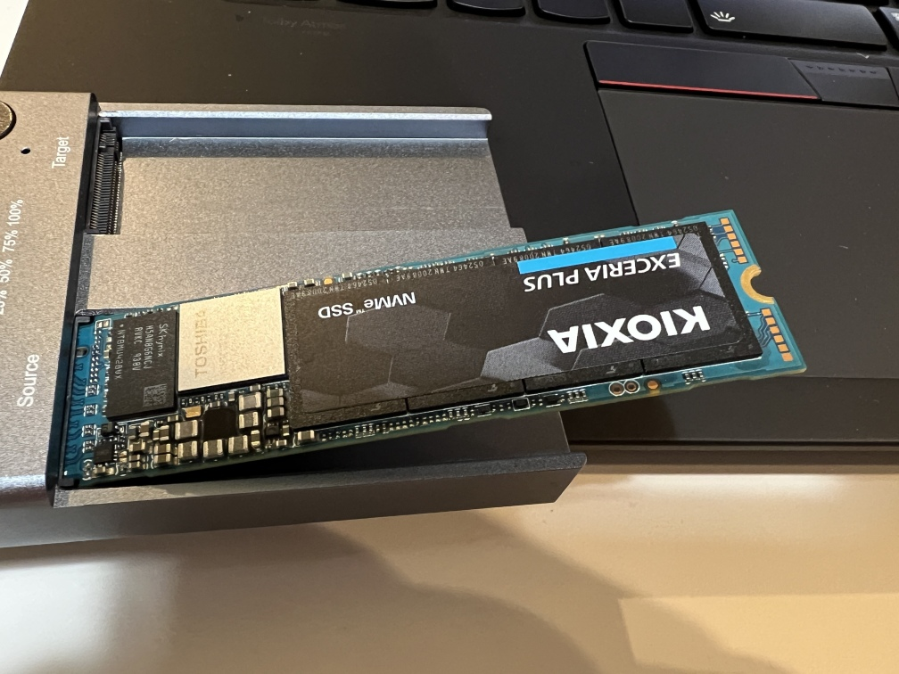
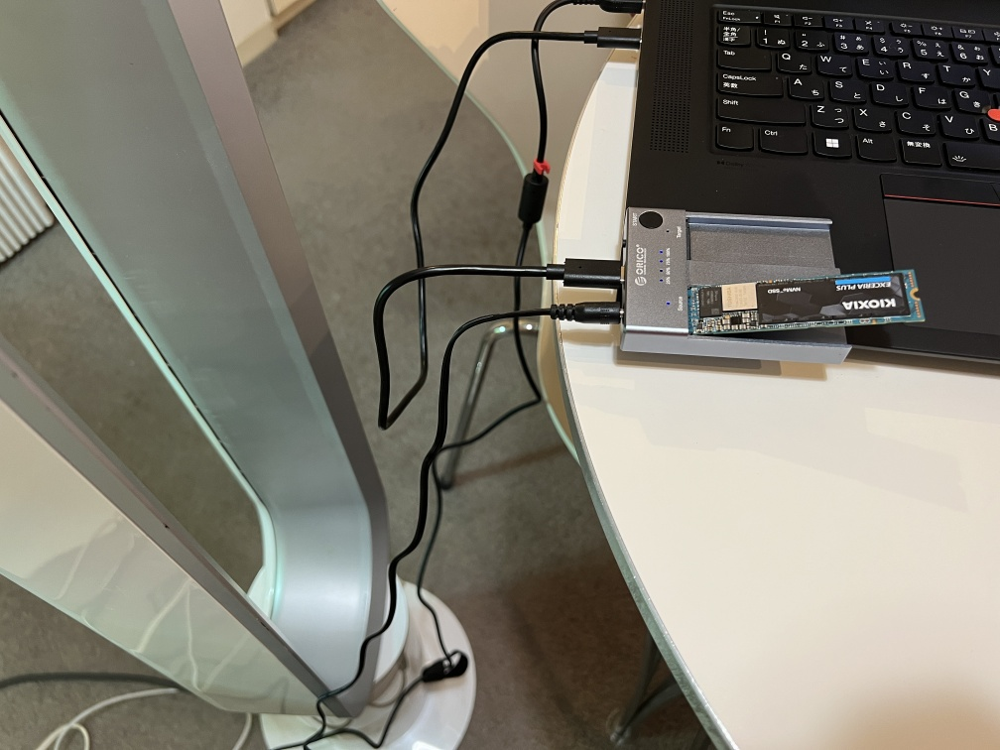
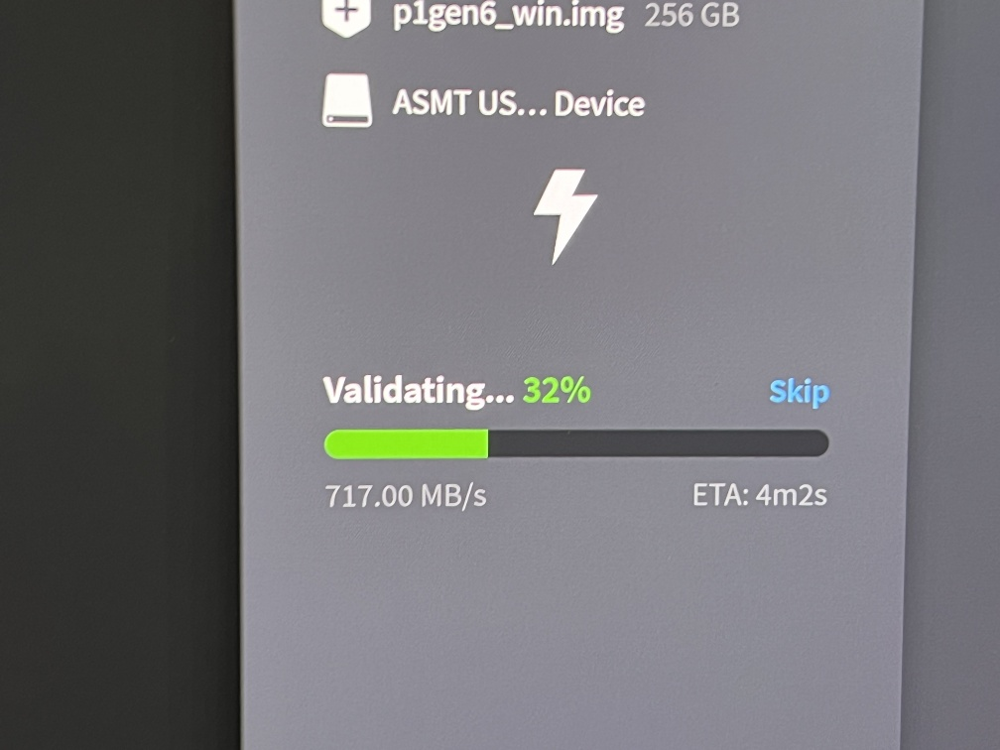
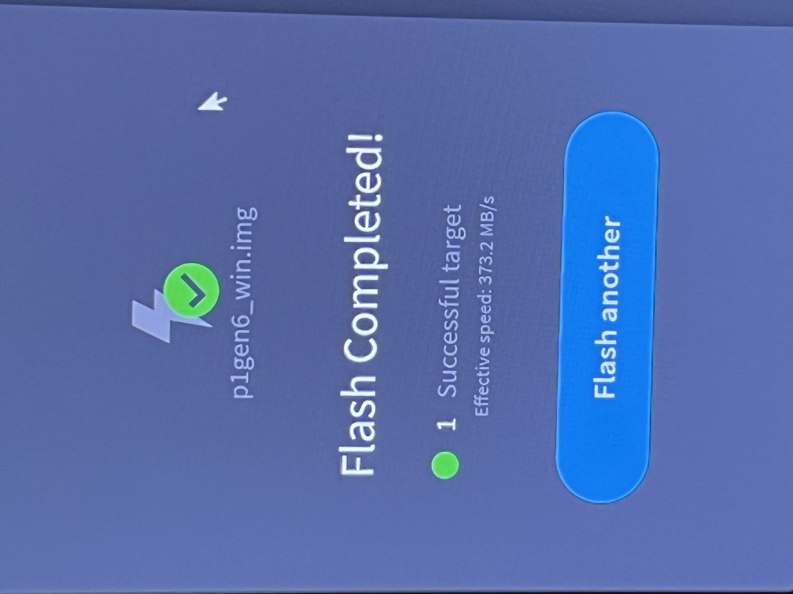

# 日記（2023年10月4日）

　査読早うせいと突っつかれながら日記といふものをしてみむとてするなり。原稿の話とMisskeyの話とノートPCいじりの話。

## Software Design [魅惑の自作シェルの世界](/?page=rusty_bash)

　12月号の原稿を提出しました。リダイレクトのエラー処理と「フォークなしリダイレクト」の実装です。フォークなしリダイレクトについては、[先日のシェル芸勉強会](/?post=shellgei_66_links)でも扱っていますので、ぜひ勉強会の動画を見てみてください。

## 自分の運営するMisskeyのサーバの評論・驚き屋禁止ルールに関して

　わたしの運営している[roboticskey](https://mi0.robotician.jp/)と[しぇるげいすきー](https://mi.shellgei.org/)では、どちらにも、

* **「自身の関わっていないニュースや動画のURLを貼って評論する行為（一言物申す系・驚き屋）も禁止です。内容について具体的な質問をするのは可です。」**

という決まりがあり、結果、ニュースに対してみんなでガヤガヤするということがやりにくくなっています。理由は、

<blockquote class="twitter-tweet">
自分の運営してるMisskeyサーバーでURL貼るのに厳しいルールがある理由、言ってなかったことのひとつに、「見たくなくてもURL貼ってあると人間は開いて見てしまう」ということもある。 TwitterでもFacebookでも、これで精神的な負担が増えてしまう人は多いと思われ。
&mdash; 上田隆一 (@ryuichiueda) <a href="https://twitter.com/ryuichiueda/status/1708642913507487820?ref_src=twsrc%5Etfw">October 2, 2023</a></blockquote> 

です。それから

* コミュニティーは放置しておくと、Facebookの中年の会話みたいにニュースに群がってああでもないこうでもないと生産性のない評論をするためだけのサークルになってしまう。
* ブログの記事には喧嘩腰のものが多く、そういう人の記事のリンクを残しておくと、そういう人がMisskeyに寄ってくる恐れがある。
* そもそもTwitterが評論屋や驚き屋（+Twitterの炎上ツイートを見せてしまう仕組み）のおかげで、治安が悪くなっている。

という問題もあり、とにかくこれらのような状況は避けたいので、ちょっとでも火の元になるようなものはヒステリックに除去しています。ただまあ・・・これだとやっぱりワイワイ感がないんですよね・・・。

　この話長くなるので今日はもうやめておきますが、

* いちおうこういう決まりにしているけどベストとは全く考えていない
* 2回目以降の返信でURLを貼るのは（その人たち同士の会話になっていて第三者は少し気を楽に傍観できるので）、問題ない

ということだけ書いて今日は終わります。たぶん続く。

## SSDのお引越し

　買ったノートPCの256GBのSSD（Windows入り）を、手持ちの2TBのものと交換。
基本は`dd`かEtcherなどのツールで丸コピーして、余った部分を新しいパーティションにして終わりですが、使ったM.2のSSDをUSBで接続する器具↓がめちゃくちゃ発熱するし、SSD自体もめちゃくちゃ発熱するしで、数日間、書き込み失敗の連続でした。（下の写真でSSDが浮いてますが、これは安静にすれば問題ないようです。）

　で、コピーはあきらめて、2TBのほうにWindowsをクリーンインストールするかあと思ったんですけど、最後のわるあがきで、SSDに扇風機を当てることにしました。

扇風機を当てるとあら不思議。高速に書き込みが進みます。（↓の写真は書き込み後のチェックのときのものです。）

結果、一発でコピー成功しました。ローテクすぎる・・・

とにかくクソ忙しいので、無事に済んでよかったです。

　以上です。洗濯機まわりおわったので洗濯物干して寝ます。
