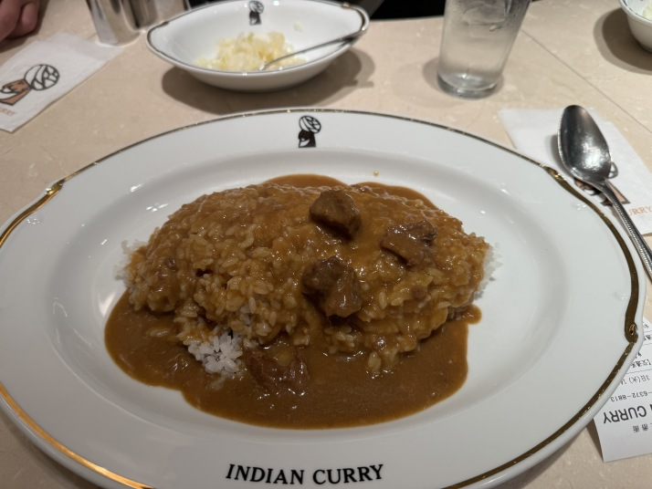

# RSJ2024

　大阪で9/3〜9/6に開催されたロボット学会に行ってきました。いろいろ報告事項があるので食ったものと一緒に書き留めておきます。

## 明石焼き

　新大阪駅で昼飯に明石焼きを食べました。火傷覚悟でしたが、観光客向けなのかそこまで強烈な熱さではありませんでした。ちょっと残念。

## インディアンカレー

　発表前に腹が減ったので、会場近くの地下街のカレー屋で2回目の昼飯。特に下調べしたわけではないんですけど関東では見ないので入りました。おいしかったです。

## 発表

　今回の発表は学術講演でなくてオープンフォーラム（なにか特定のテーマで自由に発表する会）でROSについて話をしました。内容は「ROS 2大丈夫？」という挑発的なもので、オープンフォーラムを主催したROS JAPANユーザーグループのみなさまには懐深く受け入れてもらえて命が助かりました。

<iframe width="560" height="315" src="https://www.youtube.com/embed/fUapRRTlhtM?si=R00NogcsyrqDeW0O&amp;start=2396" title="YouTube video player" frameborder="0" allow="accelerometer; autoplay; clipboard-write; encrypted-media; gyroscope; picture-in-picture; web-share" referrerpolicy="strict-origin-when-cross-origin" allowfullscreen></iframe>

動画は私のプレゼンに時間が合わせてありますが、前後の出村先生、片岡さんの発表も興味深いです。

　また、余計な情報ですが、このプレゼン資料をついったにチラ見せしてたら大バズりしましたので、そのツイートを貼り付けときます。多くの人に使ってもらえるソフトウェアを作るのは大変で、それを成し遂げた人たちには大変な敬意がありますが、その後の儲けで社内のタダ飯を喜んでインスタにアップする奴、会社の名前で中身のないプレゼンをする奴、利権を手放さないスキームを大真面目に考えている奴らは早く滅びてほしいと心から願っております。

<blockquote class="twitter-tweet">
こんな発表したらもう企業に再就職できないのではないか（さすがに当日はこのスライド使わないかも） <a href="https://t.co/REUrx2cKjE">pic.twitter.com/REUrx2cKjE</a>
&mdash; 上田隆一 (@ryuichiueda) <a href="https://twitter.com/ryuichiueda/status/1829435040738197869?ref_src=twsrc%5Etfw">August 30, 2024</a></blockquote> 

