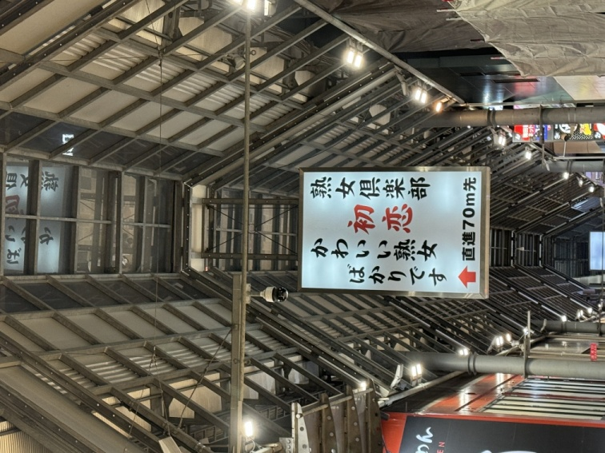
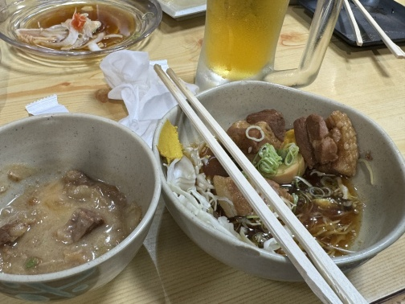

# RSJ2024に行ってきました

　大阪で9/3〜9/6に開催された[第42回ロボット学会学術講演会](https://ac.rsj-web.org/2024/)に行ってきました。いろいろ報告事項があるので食ったものと一緒に書き留めておきます。

## 明石焼き

　新大阪駅で昼飯に明石焼きを食べました。火傷覚悟でしたが、観光客向けなのかそこまで強烈な熱さではありませんでした。ちょっと残念。

## インディアンカレー

　発表前に腹が減ったので、会場近くの地下街のカレー屋で2回目の昼飯。特に下調べしたわけではないんですけど関東では見ないので入りました。おいしかったです。

## 発表

　今回の発表は学術講演でなくてオープンフォーラム（なにか特定のテーマで自由に発表する会）でROSについて話をしました。内容は「ROS 2大丈夫？」という挑発的なもので、オープンフォーラムを主催した[ROS JAPANユーザーグループ](https://rosjp.connpass.com/)のみなさまには懐深く受け入れてもらえて命が助かりました。

<iframe width="560" height="315" src="https://www.youtube.com/embed/fUapRRTlhtM?si=R00NogcsyrqDeW0O&amp;start=2396" title="YouTube video player" frameborder="0" allow="accelerometer; autoplay; clipboard-write; encrypted-media; gyroscope; picture-in-picture; web-share" referrerpolicy="strict-origin-when-cross-origin" allowfullscreen></iframe>

動画は私のプレゼンに時間が合わせてありますが、前後の出村先生、片岡さんの発表も興味深いです。

　また、余計な情報ですが、このプレゼン資料をついったにチラ見せしてたら大バズりしましたので、そのツイートを貼り付けときます。多くの人に使ってもらえるソフトウェアを作るのは大変で、それを成し遂げた人たちには大変な敬意があります。しかし、その後の惰性とも言える利益で社内のタダ飯を喜んで食ってインスタにアップする奴、会社の名前だけで中身のないプレゼンをする奴、利権を手放さないスキームを大真面目に考えている奴らは早く滅びてほしいと心から願っております。

<blockquote class="twitter-tweet">
こんな発表したらもう企業に再就職できないのではないか（さすがに当日はこのスライド使わないかも） <a href="https://t.co/REUrx2cKjE">pic.twitter.com/REUrx2cKjE</a>
&mdash; 上田隆一 (@ryuichiueda) <a href="https://twitter.com/ryuichiueda/status/1829435040738197869?ref_src=twsrc%5Etfw">August 30, 2024</a></blockquote> 

## 3次会のいい感じの居酒屋

　その後、ROS JAPAN UGの方々とファンクのかかるお店で打ち上げをやってホテルに戻ったところ、完璧に仕上がった状態のHSN先生に、 **どこのどの店なのかノーヒントで** 呼び出されました。

たぶんお初天神から[堂山町](https://ja.wikipedia.org/wiki/%E5%A0%82%E5%B1%B1%E7%94%BA)のあたりだろうと思って、上のような地図や看板を見ながらエロであふれる街（地図中の店については冷静に考えると別にエロくなくてむしろ逆）を1時間さまよった挙句、ようやくHSN先生からヒントをもらって店を見つけてどて焼きと豚の角煮をビールで食いました。堂山町でした。当たりでした（なんで当たるんだろう？）。いや、当たってたけど梅田まで引き返してたので、また堂山町まで戻りました。

食べ物は最高でしたが、HSN先生が私のビールを間違えて飲み、その後私の水も間違えて飲むという最悪さでした。面白いにもほどがある。

## 2日目の朝食

　ホテルの朝飯が2200円だったの日和ってタリーズでホットドッグを食ってたら、皿にホットドッグをひっくり返してピクルスがベトっとなりました。バチが当たりました。

## 串カツ屋

　昼は大阪に詳しい某氏に串カツ屋につれていってもらいました。昼食なのでビールが飲めなくて残念。写真はおかわりで頼んだ串揚げで、鮎がデカかったので「誰これ頼んだの！？！？」と叫んだら「お前だ」と言われました。

## 新梅田食堂街のラーメン

　夜はちょっと胃が辛かったので、大阪駅のガード下でおなかに優しそうなタンメンを食いました。家系の対極のような味でこういうのでいいんだよと100回唱えて食いました。

## ホテルの朝食

　3日目の朝食はホテルの朝食にしました。宿泊者は1600円でした。安い・・・安くはない。クルトンをスープに入れすぎてスープ全体がゲルみたいになったのは内緒だぞ！お兄さんとの約束だぞ！

## コマツさんのブース

　研究室卒業生のHさんに宣伝を頼まれました。

<blockquote class="twitter-tweet">
背後の人に宣伝しろ言われたので  ジャンカラではないです<a href="https://twitter.com/hashtag/RSJ2024?src=hash&amp;ref_src=twsrc%5Etfw">#RSJ2024</a> <a href="https://t.co/TUWEbC1WmW">pic.twitter.com/TUWEbC1WmW</a>
&mdash; 上田隆一 (@ryuichiueda) <a href="https://twitter.com/ryuichiueda/status/1831495467567644771?ref_src=twsrc%5Etfw">September 5, 2024</a></blockquote> 

ほんとにいい会社だと思います。

## 第2回明石焼き

　熱々の明石焼きを求めてリベンジマッチをしました。熱々でしたが火傷までには至らず。

## 授賞式

　学会誌論文賞をいただけたので、代表でステージに上がりました。写真は共著者のNさんです。

<blockquote class="twitter-tweet">
ヤンマーさんとのNEDOの共同研究に関する論文で、日本ロボット学会第38回学会誌論文賞をいただきました。代表で賞状を拝受しました。<a href="https://twitter.com/hashtag/RSJ2024?src=hash&amp;ref_src=twsrc%5Etfw">#RSJ2024</a> <a href="https://t.co/mj1ITPapdd">pic.twitter.com/mj1ITPapdd</a>
&mdash; 上田隆一 (@ryuichiueda) <a href="https://twitter.com/ryuichiueda/status/1831593413638328577?ref_src=twsrc%5Etfw">September 5, 2024</a></blockquote> 

## 学会の懇親会

　ヒルトン大阪でした。受賞者だったので8000円キャッシュバックがありました。タダ飯なのに真っ先に並んで料理をとってしまいましたが、料理はたっぷりありました。いつまでそんな子供みたいなことをやってるんでしょうか。

謎シャレオツレモンもありました（謎）。

## 最終日の朝飯

　前日と同じくホテルの朝食にしましたが、和食に切り替えました。どうも最近はどこのホテルも和食とご当地料理に凝っているみたいなんですが、私としてはベーコンとスクランブルエッグを完璧に仕上げるほうに全力投球していただきたいなと。オムレツ焼いてくれる人がいたりするのも好きです。（何様なんだ。）

## 最終日の昼飯

　会議で支給された弁当だったので省略。

## 最終日の夕方

　串カツ屋でビールが飲めなかった恨みを同じ店で晴らしましたとさ。

## 帰宅後の夕飯

　お土産のどて焼きで総仕上げを行いました。箱買いしてこればよかった。

## さいごに

　いかがでしたでしょうか？（👈クソブログの証）

・・・え？食ってばっかり？真面目に学会出てたらそりゃあそうなるでしょうが。お店の名前が知りたければこっそり教えます。

 

　現場からは以上です。
