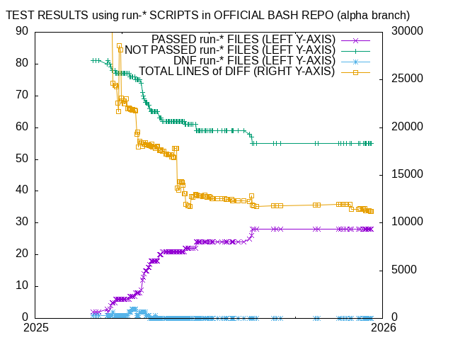

# 2025年の生産物

　講義が一段落して年末年始でまた何か始めたい（いろいろプランあり）という状況なんですが、たぶん今年作ったもの一覧を書いておかないとやり散らかしになるので振り返ってみました。


## ロボット学会のセミナーの物騒なスライド

　[昨年のロボット学会学術講演会でのROS 2に関するブチギレ発表](https://www.docswell.com/s/ryuichiueda/54VVYD-2024-09-03-ros-ug)に次いで、2年連続でブチギレ発表をしました。研究者は研究発表をしなければという自身の思いとは裏腹にそういうキャラクターに成り果てていて涙も枯れ果てました。

<script async class="docswell-embed" src="https://www.docswell.com/assets/libs/docswell-embed/docswell-embed.min.js" data-src="https://www.docswell.com/slide/K37XMM/embed" data-aspect="0.5625"></script><div class="docswell-link"><a href="https://www.docswell.com/s/ryuichiueda/K37XMM-2025-12-02-rsj-seminar">自律移動と最適制御 by @ryuichiueda</a></div>

## ソフトウェアデザインの連載（26回〜37回）

　2022年12月から始まった「[魅惑の自作シェルの世界](/?page=sd_rusty_bash)」が今年も打ち切りにならず続いてます。シェル芸で各回のタイトルを抜き出すとこんな感じです。コマンドの引数、関数、変数についてひたすら実装を進めていたようです（覚えてない）。

```
🍣 head -n 3 2025*/2025??.md | grep "^第" | sed 's/^/* /'
* 第26回: 変数の置換とチルダ展開
* 第27回: 単語の分割
* 第28回: パス名展開（前編）
* 第29回: パス名展開（中編）
* 第30回: パス名展開（後編）
* 第31回: コマンド置換
* 第32回: ダブルクォートによるクォート
* 第33回: 関数の実装（前半）
* 第34回: 関数の実装（後半）
* 第35回: 代入の実装
* 第36回: 代入とコマンドの組み合わせ
* 第37回: `local`の実装（前編）
```

　裏の話をすると、今年前半が原稿のストックが数ヶ月分あったのですが、あとで書くように忙しくなったので最後の数回は結構大変でした。それでも締め切り10日前には書けてましたが。正月も少し書き進めておこうと思います。

## 寿司シェル

　連載のもとになっている[自作シェル](https://github.com/shellgei/rusty_bash)の実装については、今年はこんなことがありました。

* [bash-completionが動くようになって](/?post=20250217)十分実用に耐えうるようになり、自分でもBashから乗り換えることに成功
* 国内外からプルリクエストが来るようになった（けど対応があんまりよくないかも）
    * 対応があんまり・・・というのは、すごくたくさん提案してくれる方が現れたんですが、こちらはマイペースでやってるのであんまり時間をかけて議論ができないうちに疎遠になってしまったということがありました。
* Bashとの互換性のテストを導入して進捗をグラフにして自分にプレッシャーをかける
    

　今後については・・・どうしましょう？LLMと繋げてみます？

## 画像処理（と言いつつ人工ニューラルネットワーク）の講義資料

　本年度は急遽、大学院の画像処理の講義を追加で受け持つことになりました。後期の講義で5月ごろに担当が決まったので、すぐに構成をどうするか考え始めたんですが、今はVLM（vision-language model）の時代なので、思い切って全編人工ニューラルネットワークだけで構成してみました。といっても自分はここらへんの経験がないので、文献を読みまくって勉強しながらだったので、今年一番時間をかけた仕事になりました。

- [第1回: ガイダンス・イントロダクション](https://ryuichiueda.github.io/slides_marp/advanced_vision/lesson1.html)
- [第2回: 人工ニューラルネットワークの学習](https://ryuichiueda.github.io/slides_marp/advanced_vision/lesson2.html)
- [第3回: 画像の識別と生成の基礎I](https://ryuichiueda.github.io/slides_marp/advanced_vision/lesson3.html)
- [第4回: 画像の識別と生成の基礎II](https://ryuichiueda.github.io/slides_marp/advanced_vision/lesson4.html)
- [第4.5回: 画像の識別と生成の基礎II（の補足）](https://ryuichiueda.github.io/slides_marp/advanced_vision/lesson4-2.html)
- [第5回: 埋め込みと文脈の付加](https://ryuichiueda.github.io/slides_marp/advanced_vision/lesson5.html)
- [第6回: Transformerの構造](https://ryuichiueda.github.io/slides_marp/advanced_vision/lesson6.html)
- [第7回: Transformerの応用](https://ryuichiueda.github.io/slides_marp/advanced_vision/lesson7.html)
- [第8回: 画像処理と言語処理の融合](https://ryuichiueda.github.io/slides_marp/advanced_vision/lesson8.html)
- [第9回: 画像と言語、ロボット制御の融合I](https://ryuichiueda.github.io/slides_marp/advanced_vision/lesson9.html)
- [第10回: 画像と言語、ロボット制御の融合II](https://ryuichiueda.github.io/slides_marp/advanced_vision/lesson10.html)
- [第11回: NeRFと3DGS](https://ryuichiueda.github.io/slides_marp/advanced_vision/lesson11.html)


## 確率ロボティクスの講義資料

　こっちは毎年やっている講義ですが、[灰色の本](https://amzn.to/49mhD6Z)に基づいた内容に刷新すると決めてシラバスにも書いてしまったので、こちらも新たに資料を作り直しました。作り直しているときに↑の話になったので、もう今年は研究無理だと腹をくくりましたが、学生さんのおかげでなんとかなってます。

- [確率ロボティクス第1回（その2）: 統計の基礎と代表値](https://ryuichiueda.github.io/slides_marp/prob_robotics_2025/lesson1-2.html)
- [確率ロボティクス第1回（その1）: イントロダクション](https://ryuichiueda.github.io/slides_marp/prob_robotics_2025/lesson1.html)
- [確率ロボティクス第2回（その1）: 確率と信頼性工学](https://ryuichiueda.github.io/slides_marp/prob_robotics_2025/lesson2-1.html)
- [確率ロボティクス第2回（その2）: 確率変数，確率質量関数と確率分布](https://ryuichiueda.github.io/slides_marp/prob_robotics_2025/lesson2-2.html)
- [確率ロボティクス第3回: 期待値](https://ryuichiueda.github.io/slides_marp/prob_robotics_2025/lesson3.html)
- [確率ロボティクス第4回: 連続値と多変量（その1）](https://ryuichiueda.github.io/slides_marp/prob_robotics_2025/lesson4-1.html)
- [確率ロボティクス第4回: 連続値と多変量（その2）](https://ryuichiueda.github.io/slides_marp/prob_robotics_2025/lesson4-2.html)
- [確率ロボティクス第4回: 連続値と多変量（その3）](https://ryuichiueda.github.io/slides_marp/prob_robotics_2025/lesson4-3.html)
- [確率ロボティクス第5回: 試行回数と信頼性](https://ryuichiueda.github.io/slides_marp/prob_robotics_2025/lesson5.html)
- [確率ロボティクス第6回: 動く確率分布（その1）](https://ryuichiueda.github.io/slides_marp/prob_robotics_2025/lesson6-1.html)
- [確率ロボティクス第6回: 動く確率分布（その2）](https://ryuichiueda.github.io/slides_marp/prob_robotics_2025/lesson6-2.html)
- [確率ロボティクス第7回: センシングと推定（その1）](https://ryuichiueda.github.io/slides_marp/prob_robotics_2025/lesson7-1.html)
- [確率ロボティクス第7回: センシングと推定（その2）](https://ryuichiueda.github.io/slides_marp/prob_robotics_2025/lesson7-2.html)
- [確率ロボティクス第8回: 機械学習（その1）](https://ryuichiueda.github.io/slides_marp/prob_robotics_2025/lesson8-1.html)
- [確率ロボティクス第8回: 機械学習（その2）](https://ryuichiueda.github.io/slides_marp/prob_robotics_2025/lesson8-2.html)
- [確率ロボティクス第9回: 行動決定（その1）](https://ryuichiueda.github.io/slides_marp/prob_robotics_2025/lesson9-1.html)
- [確率ロボティクス第9回: 行動決定（その2）](https://ryuichiueda.github.io/slides_marp/prob_robotics_2025/lesson9-2.html)


## 確率ロボティクスの講義動画

## シェル芸勉強会

## 横幹連合での発表

## 学生さんの予稿

　学生さんの成果は学生さん自身のものですが、研究に関しては多くを学生さんに託しているので、まずこれを書いておきます。いつもは年度でリスト化してますが、ここでは2025年というくくりで。林原先生が共著の4件は口出しだけでちゃんと添削できなかったので反省です。他のものについては添削しつこすぎて反省。

　あと特筆事項はニューラルネットのが5件、確率ロボティクスのが4件ですね。ここ数年、こういう割合です。

* 髙澤怜里, 上田隆一, 山野辺夏樹, 藤井浩光: 編み物における技能理解のためのLSTMによる手先動作の解析, 第30回ロボティクスシンポジア講演論文集, pp.173-178, 2025.
* 吉越 誠, 林原 靖男, 上田 隆一: 移動ロボットのための彷徨しながらの衛星測位によるLiDARベースの自己位置推定の破綻からの復帰法とナビゲーションの継続, 第30回ロボティクスシンポジア講演論文集, pp.107-112, 2025.
* 石黒巧, 佐藤蓮, 上田隆一, 林原靖男: 視覚と行動のend-to-end学習により経路追従行動を 模倣する手法の提案 ―シナリオ駆動型ナビゲーションのための 学習フレームワークの構築と検証―, 日本機械学会ロボティクス・メカトロニクス講演会2025講演論文集, 2A1-P05, 2025.
* 髙橋聖空, 坪内優輝, 上田隆一, 林原 靖男: 視覚と行動のend-to-end 学習により経路追従行動をオンラインで模倣する手法の提案 ―未知障害物回避行動の分析と実環境適用に向けた検討―, 日本機械学会ロボティクス・メカトロニクス講演会2025講演論文集, 2A2-R01, 2025.
* 船井涼, 林原靖男, 上田隆一: 移動ロボットのためのベクトル量子化による占有格子地図の圧縮と圧縮したままの地図を利用した自己位置推定, 第43回日本ロボット学会学術講演会, RSJ2025AC3Q3-08, 2025.
* 中村啓太郎, 林原靖男, 上田隆一: 自律移動ロボットのための価値反復とA*探索を組み合わせた大域経路計画 ---探索空間を3次元に拡張したAとの組み合わせの検討, 第43回日本ロボット学会学術講演会, RSJ2025AC3Q3-06, 2025.
* 今井悠月, 上田隆一, 林原靖男: 視覚と行動のend-to-end 学習による経路追従行動の模倣 ―教師データの自己情報量に基づく重みづけ学習手法の提案―, 計測自動制御学会第26回システムインテグレーション部門講演会, pp.1875-1880, 2025.
* 馬場琉生, 上田隆一, 林原靖男: 物体追跡導入によるリアルタイム・ゼロショットセグメンテーション —自律走行モビリティにおける認識・判断タスクへの応用—, 計測自動制御学会第26回システムインテグレーション部門講演会, pp.1033-1037, 2025.
* 佐々木新平, 吉越誠, 林原靖男, 上田隆一: 自律移動ロボットの自己位置推定におけるVisual Positioning Systemを用いたリセット手法, 計測自動制御学会第26回システムインテグレーション部門講演会, pp.1674-1676, 2025.


## まだ出てないけど頑張ったやつ

### 投稿論文（なんだけど世に出ない）


### 書きかけの本

　ふふふ・・・
