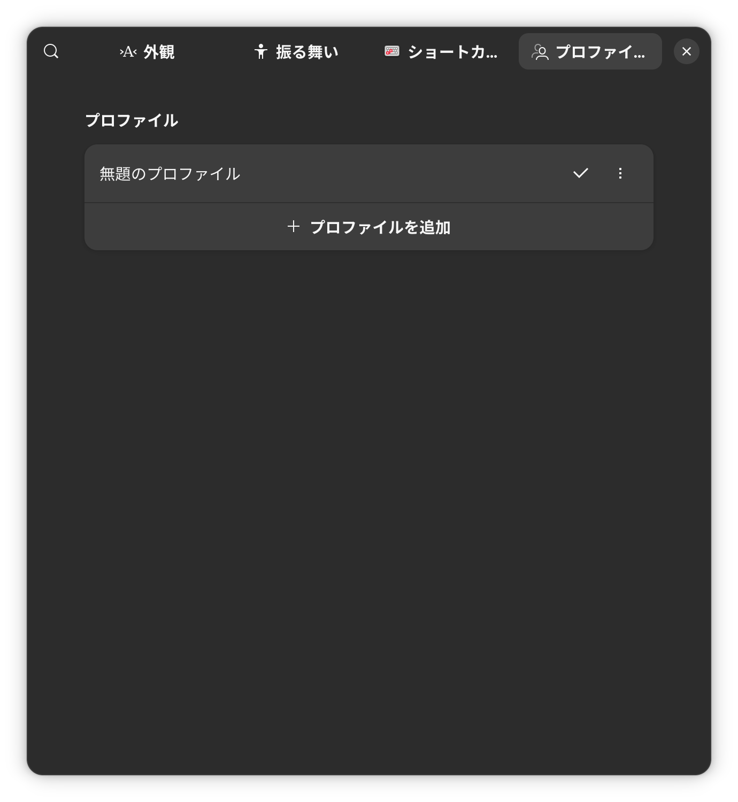
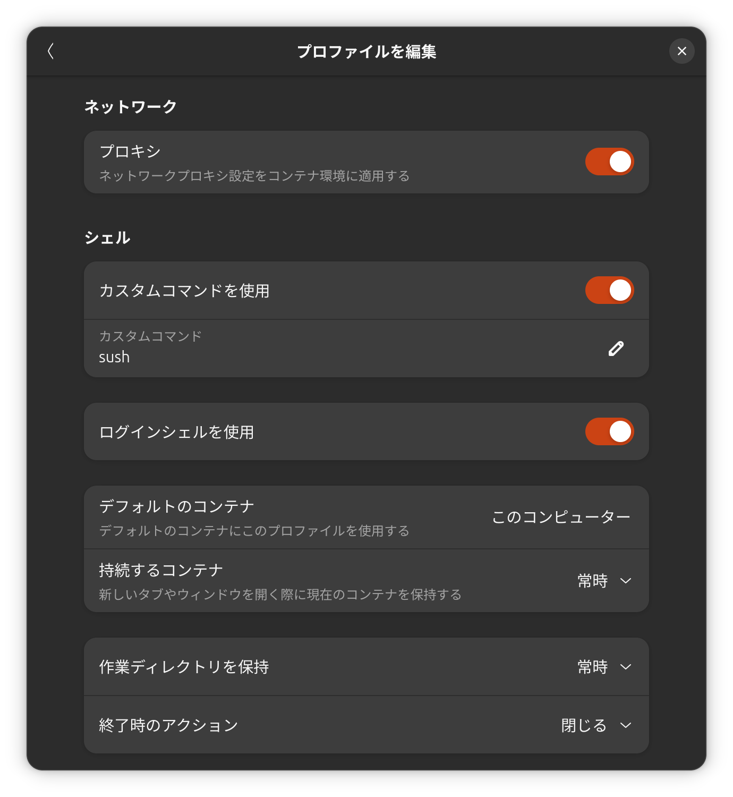

# Ubuntu 26.04 LTSのターミナルでsushをデフォルトのシェルにする

　この前から自作シェルの[rusty_bash（sush、寿司シェル）](https://github.com/shellgei/rusty_bash)をUbuntuのターミナルから直接立ち上げているので、その方法のメモ書きです。<span style="color:red">場合によってはうまく立ち上がらなくなって、コンソールから復旧しないといけなくなるので、自己責任でお願いいたします。</span>ターミナルの設定画面を開きっぱなしにして試すのが安全です。

　バージョンは今の時点ではv1.3.2以降がおすすめです。

## 手順

### ホームに`.sushrc`を置く

　例を置いときます。

```bash
case $- in
    *i*) ;;
      *) return ;;
esac

case "$TERM" in
    xterm-color|*-256color) color_prompt=yes;;
esac


if [ "$color_prompt" = yes ]; then
        PS1='\[\033[01;32m\]\u@\h\[\033[00m\]:\[\033[01;36m\]\b\[\033[00m\]\[\033[01;35m\]\w\[\033[00m\]🍣 'else
        PS1='\u@\h:\w(debug)🍣 '
fi 

case "$TERM" in
xterm*|rxvt*)
    PS1="\[\033]2;\u@\h: \w\007\]$PS1"
    ;;  
*)
    ;;
esac    

PS2='> '
PS4='+ '
alias ll='ls -al'
alias ls='ls --color=auto'
alias today='date +%Y%m%d'

alias git-writing='git add -A ; git commit -m Writing; git push'

if [ -f /usr/share/bash-completion/bash_completion ]; then
    . /usr/share/bash-completion/bash_completion
    _comp_complete_load scp #for completion of rsync
elif [ -f /etc/bash_completion ]; then
    . /etc/bash_completion
fi

complete -d cd
```

### パスの通っているところに`sush`を置く

　↑の意味がわからん場合はやらんほうがいいと思います。

```bash
### 別のシェルで作業しましょう ###
$ cd <リポジトリのディレクトリ>
$ cargo build --release
$ sudo cp target/release/sush /bin/
### 動作確認 ###
$ sush
Sushi shell (a.k.a. Sush), バージョン 1.3.2 - release
ueda@p1gen6:main🌵~/GIT/rusty_bash🍣 exit
$ 
```

### ターミナルの設定画面を開く

　Ubuntu 26.04 LTSの場合はこんな画面（慣れない・・・）。



　上のタブのプロファイルを選ぶと↑という画面になるので、そこで「無題のプロファイル」をクリックして下にスクロールすると、↓のように「シェル」という項目があります。そこで、↓のように、「カスタムコマンドを使用」を選択肢、カスタムコマンドに`sush`と記入します。また、この画像では「ログインシェルを使用」にもチェックが入っていますが、たぶん`sush`のほうが対応していないので意味はないです。

　もう一点、下にある「作業ディレクトリを保持」を「常時」にしておきます。これで、ターミナルのタブを開いたときに、元にいたディレクトリが引き継がれます。




　以上です。もういっぺん書いておくと、ミスると大変面倒くさいことになるので、試す場合は慎重にお願いします。
