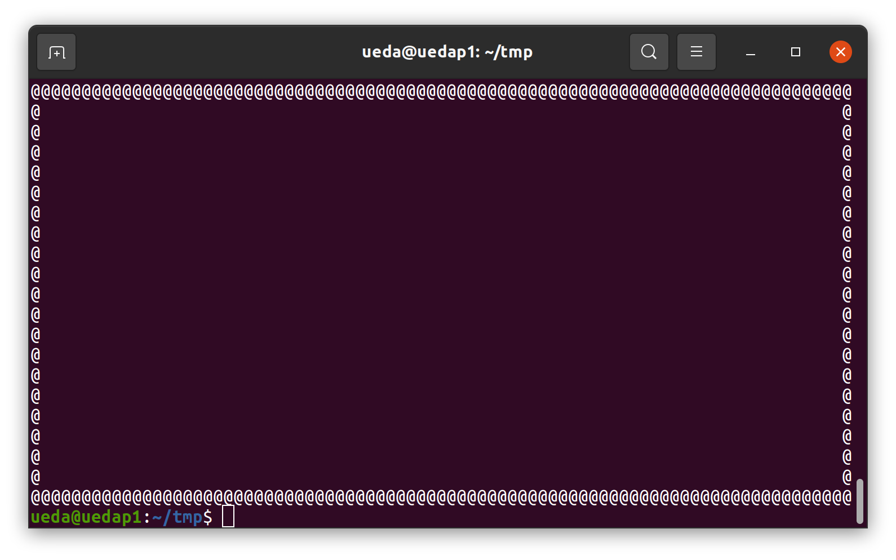
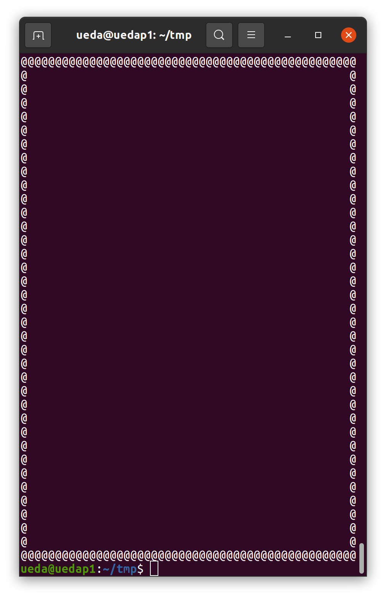

# 【問題と解答】jus共催 第55回TOKY 02020オフィシェルシェル芸勉強会KAWASAKI2021

* 問題で使われているデータファイルは[GitHub](https://github.com/ryuichiueda/ShellGeiData/tree/master/vol.55)にあります。クローンは以下のようにお願いします。

```bash
$ git clone https://github.com/ryuichiueda/ShellGeiData.git
```

* 環境: 解答例はUbuntu 20.04 LTSで作成。Macの場合はcoreutilsをインストールすると、GNUのコマンドが使えます。BSD系の人は玄人なので各自対応のこと。

## Q1

次の図形を描いてください。for文やwhile文は禁止とします。

```
* * * * * * * *
* *         * *
*   *     *   *
*     * *     *
*     * *     *
*   *     *   *
* *         * *
* * * * * * * *
```


## Q2

次のおしゃれなUNKOを落ち着かせてASCIIコードのUNKOに戻してください。どんな変換方法でも構いませんが、`UNKO`の4個の大文字と、元の`𝒰𝒩𝒦𝒪`の4文字は使用禁止にします。元の`𝒰𝒩𝒦𝒪`由来のデータを使わない方法も禁止です。

```bash
$ echo 𝒰𝒩𝒦𝒪 
```


## Q3

次のふたつの出力例のように、端末のフチに`@`を並べてください。for文やwhile文は禁止とします。





## Q4 

端末上で次のような出力を得てください。


## Q5

次の`words`について、同じ文字がちょうど3つ存在し、他に同じ文字がちょうど2つ存在する単語を抽出してください。

```bash
$ cat words 
metabolizes
Manuela
Kroger
purchasable
luster
clattering
mesh
campus
seating
giblet
・・・
```

## Q6 

次のような模様を描いてください。

```bash
💩　　　💩　　　💩　　　💩　　　💩　　　💩　　　💩　　　💩　　　💩
　💩　💩　💩　💩　💩　💩　💩　💩　💩　💩　💩　💩　💩　💩　💩　💩　
　　💩　　　💩　　　💩　　　💩　　　💩　　　💩　　　💩　　　💩　　
　💩　💩　💩　💩　💩　💩　💩　💩　💩　💩　💩　💩　💩　💩　💩　💩　
💩　　　💩　　　💩　　　💩　　　💩　　　💩　　　💩　　　💩　　　💩
　💩　💩　💩　💩　💩　💩　💩　💩　💩　💩　💩　💩　💩　💩　💩　💩　
　　💩　　　💩　　　💩　　　💩　　　💩　　　💩　　　💩　　　💩　　
　💩　💩　💩　💩　💩　💩　💩　💩　💩　💩　💩　💩　💩　💩　💩　💩　
💩　　　💩　　　💩　　　💩　　　💩　　　💩　　　💩　　　💩　　　💩
　💩　💩　💩　💩　💩　💩　💩　💩　💩　💩　💩　💩　💩　💩　💩　💩　
　　💩　　　💩　　　💩　　　💩　　　💩　　　💩　　　💩　　　💩　　
　💩　💩　💩　💩　💩　💩　💩　💩　💩　💩　💩　💩　💩　💩　💩　💩　
💩　　　💩　　　💩　　　💩　　　💩　　　💩　　　💩　　　💩　　　💩
　💩　💩　💩　💩　💩　💩　💩　💩　💩　💩　💩　💩　💩　💩　💩　💩　
　　💩　　　💩　　　💩　　　💩　　　💩　　　💩　　　💩　　　💩　　
　💩　💩　💩　💩　💩　💩　💩　💩　💩　💩　💩　💩　💩　💩　💩　💩　
💩　　　💩　　　💩　　　💩　　　💩　　　💩　　　💩　　　💩　　　💩
　💩　💩　💩　💩　💩　💩　💩　💩　💩　💩　💩　💩　💩　💩　💩　💩　
　　💩　　　💩　　　💩　　　💩　　　💩　　　💩　　　💩　　　💩　　
　💩　💩　💩　💩　💩　💩　💩　💩　💩　💩　💩　💩　💩　💩　💩　💩　
💩　　　💩　　　💩　　　💩　　　💩　　　💩　　　💩　　　💩　　　💩
　💩　💩　💩　💩　💩　💩　💩　💩　💩　💩　💩　💩　💩　💩　💩　💩　
　　💩　　　💩　　　💩　　　💩　　　💩　　　💩　　　💩　　　💩　　
　💩　💩　💩　💩　💩　💩　💩　💩　💩　💩　💩　💩　💩　💩　💩　💩　
💩　　　💩　　　💩　　　💩　　　💩　　　💩　　　💩　　　💩　　　💩
　💩　💩　💩　💩　💩　💩　💩　💩　💩　💩　💩　💩　💩　💩　💩　💩　
　　💩　　　💩　　　💩　　　💩　　　💩　　　💩　　　💩　　　💩　　
　💩　💩　💩　💩　💩　💩　💩　💩　💩　💩　💩　💩　💩　💩　💩　💩　
💩　　　💩　　　💩　　　💩　　　💩　　　💩　　　💩　　　💩　　　💩
　💩　💩　💩　💩　💩　💩　💩　💩　💩　💩　💩　💩　💩　💩　💩　💩　
　　💩　　　💩　　　💩　　　💩　　　💩　　　💩　　　💩　　　💩　　
　💩　💩　💩　💩　💩　💩　💩　💩　💩　💩　💩　💩　💩　💩　💩　💩　
💩　　　💩　　　💩　　　💩　　　💩　　　💩　　　💩　　　💩　　　💩
```


## Q7

`words`について、しりとりになっている行を横一列に出力してください。大文字小文字は区別しません。出力は次のようになります。

```
campus seating giblet Tomas
lifeless secures
clews shove exhaust
orifice equivocal
```

