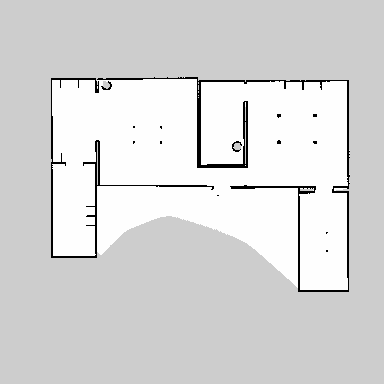
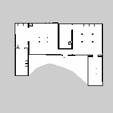

# 【問題と解答】jus共催 第56回シェル・ワンライナー160本ノックアウトシェル芸勉強会

* 問題で使われているデータファイルは[GitHub](https://github.com/ryuichiueda/ShellGeiData/tree/master/vol.56)にあります。クローンは以下のようにお願いします。

```bash
$ git clone https://github.com/ryuichiueda/ShellGeiData.git
```

* 環境: 解答例はUbuntu 20.04 LTSで作成。Macの場合はcoreutilsをインストールすると、GNUのコマンドが使えます。BSD系の人は玄人なので各自対応のこと。

## Q1

日本語を入力せずに、端末に`月月火水木金金`と出力してください。

### 解答例

```
$ cal | sed -n 2p | sed 's/^.//;s/...$//' | tr -d ' '| sed 's/^./&&/;s/.$/&&/'
月月火水木金金
```

## Q2

次のコマンドからパイプをつなげて、「今日の仕事は、楽しみですか。」と出力してください。

```
$ echo 今楽日しのみ仕で事すはか、。
```

### 解答例

```
$ echo 今楽日しのみ仕で事すはか、。 | sed p | sed -E '1s_(.)._\1_g;2s_.(.)_\1_g' | paste -sd ''
$ echo 今楽日しのみ仕で事すはか、。 | fold -b6 | sed 's/./& /' | rs -T | tr -d ' \n' | awk 4
```


## Q3

　`red.txt`から色（ANSIカラーコード）を除去してください。特に一般解を考える必要はありません。

```
$ less red.txt
・・・
perESC[01;31mESC[KseESC[mESC[Kvering
furtivenESC[01;31mESC[KesESC[mESC[Ks's
remeESC[01;31mESC[KdiESC[mESC[Ked
・・・
```

### 解答例

```
$ cat red.txt | sed 's/\x1b\[01;31m//g' | sed 's/\x1b\[K//g' | sed 's/\x1b\[m//g'
### nodeのstrip-ansiを使う ###
$ cat red.txt | strip-ansi
```

## Q4

端末に次のように描画してください。


### 解答例

```
$ echo -e '11\n 11  44\n     433\n6666 433' | sed 's/ /  /g' | sed 's/[^ ]/\x1b[4&m  \x1b[m/g'
```

## Q5

`ros_log`ファイルは、複数のプロセスがログを書き込んだファイルです。次のように`VALUE`という文字列を`grep`で検索すると、行の最初の文字列が欠けている行があります。

```bash
$ grep VALUE ros_log
[ INFO] [1634194596.339889867, 13.823000000]: VALUE ITERATION START
[ INFO] [1634194606.707089069, 24.183000000]: VALUE ITERATION END
（中略）
[ INFO] [1634194838.176935414, 255.523000000]: VALUE ITERATION START
[ INFO] [1634194849.754396571, 267.092000000]: VALUE ITERATION END
31, 306.723000000]: VALUE ITERATION START
[ INFO] [1634194901.293168836, 318.602000000]: VALUE ITERATION END
[ INFO] [1634194928.835154334, 346.130000000]: VALUE ITERATION START
[ INFO] [1634194939.614970195, 356.902000000]: VALUE ITERATION END
```

### 小問1

この、欠けている文字列を`ros_log`から探してください。

### 小問2

欠けている部分を上の`grep VALUE ros_log`の出力につなげて、各行に描いてあるふたつの数字の差を出力してください。左の数字はシステムの時刻、右の数字はプログラムが走り出してからの秒数なので、すべての行の差が（だいたい）一致すると、正しくデータが復元していることが分かります。


### 解答例

#### 小問1

ログの壊れ方にもよりますが、`ros_log`の場合は次のような正規表現で検出できます。

```bash
$ grep -E '[0-9]{10}\.[0-9]{7}[^0-9]' ros_log
[ INFO] [1634194889.4049047[INFO] [1634194845.100680, 262.442000]: DELTAS: 42.0, 4298.0, 995.0, 231.0, 148.0, 909.0, 995.0, 269.0
```


#### 小問2

```bash
$ grep -E '[0-9]{10}\.[0-9]{7}[^0-9]' ros_log | sed 's/\[I.*//' | cat - <(grep VALUE ros_log ) | awk 'NR==1{a=$0;$0=""}/^3/{$0=a$0}NF{print}' | awk '{print $3,$4}' | tr -d '[],:' | awk '{printf("%f\n", $1-$2)}'
1634194582.516890
1634194582.524089
1634194582.546208
1634194582.554430
1634194582.562755
1634194582.571231
1634194582.584208
1634194582.591131
1634194582.617389
1634194582.625124
1634194582.653935
1634194582.662397
1634194582.681905
1634194582.691169
1634194582.705154
1634194582.712970
```

## Q6

`house.pgm`は、ある環境の地図です。この地図は1画素で5[cm]四方の領域に物があるかないかを示したものですが、1画素10[cm]四方に解像度をさげたいと考えました。田字型の4区画で、値が最も小さい（色の濃い）画素を残す方法で、解像度を下げて`house_s.pgm`というファイルに保存してください。基本的に画素をAWK等で加工する解を想定していますが、できる人はImageMagickを使ってもかまいません。また、AWK等で処理する場合、できる人はforやwhile文を使わないでやってみましょう。


* 図: 解像度を下げる前後の地図





### 解答例

```
$ convert house.pgm -compress None - | awk 'NR>=6' | sed 's/ /\n/g' |
awk NF | paste - - | awk '{print ($1<$2?$1:$2)}' | xargs -n 192 |
rs -T | sed 's/ /\n/g' | awk NF | paste - - |
awk '{print ($1<$2?$1:$2)}' | xargs -n 192 | rs -T |
cat <(head -n 4 house.pgm ) - | sed '1s/P5/P2/' | sed 2d |
sed '2s/384/192/g' > house_s.pgm
```

## Q7

`a^3 + b^3 = 6963472309248`、`a <= b`となる整数の組`(a,b)`を全て求めてください。できる人は、`48988659276962496`に対して同様に`(a,b)`を求めてください（桁落ち注意）。

* 参考

<blockquote class="twitter-tweet" data-partner="tweetdeck"><p lang="und" dir="ltr">1^3+12^3 = 1729<br>9^3+10^3 = 1729<br>2^3+16^3 = 4104<br>9^3+15^3 = 4104<br>18^3+20^3 = 13832<br>2^3+24^3 = 13832<br>10^3+27^3 = 20683<br>19^3+24^3 = 20683<br>18^3+30^3 = 32832<br>4^3+32^3 = 32832 <a href="https://t.co/AgL4oWf309">https://t.co/AgL4oWf309</a></p>&mdash; シェル芸bot (@minyoruminyon) <a href="https://twitter.com/minyoruminyon/status/1451311167029198851?ref_src=twsrc%5Etfw">October 21, 2021</a></blockquote>
<script async src="https://platform.twitter.com/widgets.js" charset="utf-8"></script>

### 解答例

```bash
$ seq inf | awk '{print $1,6963472309248 - $1^3}' |
awk '$2>0;$2<=0{exit}' | teip -f 2 factor |
grep -P ': ((\d+) \2 \2)( (?1))*$' |
awk '{a=1;for(i=3;i<=NF;i+=3)a*=$i;print $1,a}' | awk '$2>=$1'
2421 19083
5436 18948
10200 18072
13322 16630
```


桁落ちの心配のないもの。

```bash
$ seq inf | awk '{print "48988659276962496 -", $1 "^3"}' |
bc | awk '$1>0;$1<=0{exit}' | factor | awk '{print NR,$0}' |
grep -P ': ((\d+) \2 \2)( (?1))*$' |
awk '{a=1;for(i=3;i<=NF;i+=3)a*=$i;print $1,a}' | awk '$2>=$1'
38787 365757
107839 362753
205292 342952
221424 336588
231518 331954
```

